<a href="images_readme/banner1.png">
  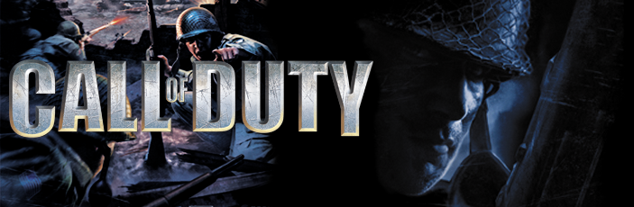
</a>   

<!-- [1.] -->
<!-- [1.] -->
<!-- [1.] -->

# Introduction

rPAM is the updated competition mod for Call of Duty 1.5, building on previous PAM releases.

> **Supported Game Version:** `Call of Duty (2003) Multiplayer` `v1.5`  
> **Actual rPAM Version:** `TBA`  
> **Actual rPAM Maps Version:** `v2.2`

> **You can support this project via PayPal:**    
> `Optional Donation` `(€)` `Billing Address Required`    
> [***rPAM PayPal Donation Page***](https://www.paypal.com/donate/?hosted_button_id=NB3GC298ZMJG4) 

> **Join the CoDBASE Call of Duty 1 Community**:       
`Call of Duty (2003) Multiplayer` `v1.5`     
`European playerbase` [***Discord Invite Link***](https://discord.gg/Zh8DP7c)      
> **Adapted to the latest CoDBASE PAM version:**      
`Coming soon` `v1.5` `rPAM` `kikiii's pam port`  
 

The goal of this project is to develop features requested by the playerbase while preserving core gameplay at the highest competitive standard established in recent years.

rPAM was initiated by me in 2015, after CyberGamer's edited PAM failed to fix bugs and instead introduced new ones. This led me to create a version that preserves the original while correcting its flaws.

In 2024, I joined the CoDBASE Discord — a dedicated community still playing competitive 5v5 Search and Destroy, just like back in the day. Bugs persist to this day. I aim to fix that now.

> **Background of PAM:**

The original Project Ares Mod (PAM) for Call of Duty v1.5, created by Garetjax and finalized with version 1.08, laid the groundwork for competitive play in the game’s early days. Widely adopted in leagues such as ESL, ClanBase, CAL, and TWL from the 2000s through the early 2010s, PAM enabled teams to compete in structured, rule-based matches without relying on manual setup, in-game commands, or RCON intervention. Thanks to its automation and reliability, it quickly became the standard for high-level competitive play.    
The main goal was to constantly improve the game for the betterment of everyone.

> **rPAM Goals:**

* Ensure that the game remains closely aligned with the legacy established between 2004 and 2011
* Provide server operators and players with a stable, easy-to-manage experience
* Fix bugs in the current CoDBASE-PAM, based on my [rPAM v1.11](https://www.moddb.com/mods/call-of-duty-origin-of-honor/features/call-of-duty-rpam-v111) (2015)
* Retain and expand features introduced in CoDBASE-PAM (2024)
* Integrate elements from [kikiii's eyza\_pam\_port\_to\_vcod (2025)](https://github.com/tmowojtek/eyza_pam_port_to_vcod/tree/main)
* Integrate elements from [CoD2 ezya zPAM](https://github.com/eyza-cod2/zpam3), including Punkbuster settings
* Integrate elements from Anghlz PAM Mod
* Fully support and integrate custom maps
* Improve the authenticity of custom maps and align them with PAM gameplay
* Revise textures, skins, and scripts to ensure fair and balanced competitive gameplay
* Automate competitive play to reduce the need for manual intervention

  
> [go up again](#introduction) <|> [go next](#news-and-updates)
---------------------------------------------------------------------------------------------
  

<!-- [2.] -->
<!-- [2.] -->
<!-- [2.] -->

# News And Updates

- TBA
- TBA
- TBA

  
> [go up again](#introduction) <|> [go next](#howto-support-this-project)
---------------------------------------------------------------------------------------------
  

<!-- [3.] -->
<!-- [3.] -->
<!-- [3.] -->

# How To Support This Project
<a href="images_readme/ppa_png.png">
  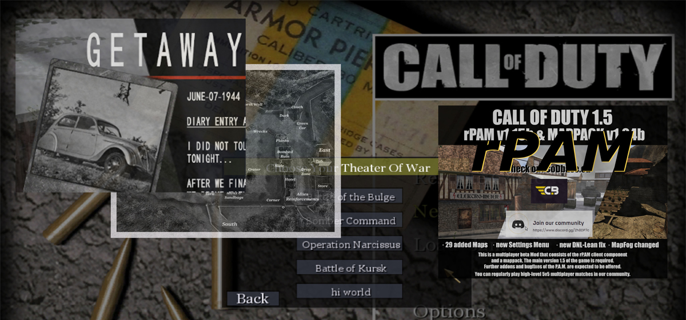
</a>  

A little throwback: Back in 2007 or 2008, I managed to add a fifth button to the main menu – that’s why it says ‘hi world. That was an achievement that I accomplished through trial and error over time. 
The images next to it are from 2010 to 2024.

### Origin of Honor Singleplayer & rPAM v1.11
- From 08/06/2014 [Call of Duty Origin of Honor - GETAWAY 1080p](https://www.youtube.com/watch?v=ziqqI1rqj-o)
   - Showcasing a modded singleplayermap
- From 04/12/2015 [Call of Duty (Origin of Honor) P.A.M. V1.11 ALPHA TESTING](https://www.youtube.com/watch?v=H-4lJH0HDgU)
- From 04/06/2015 [Call of Duty Origin of Honor - Menu](https://www.youtube.com/watch?v=ICAWwLr7_OU)
- From 05/01/2015 [CALL OF DUTY PAM V1.11 TEST3](https://www.youtube.com/watch?v=PU8UjrvVZE0)
   - Shows the further development of rPAM functions and bug fixes back in 2015.
- From 06/01/2015 [CALL OF DUTY PAM V1.11 Release](https://www.moddb.com/mods/call-of-duty-origin-of-honor/downloads/call-of-duty-rpam-v111), [CALL OF DUTY PAM V1.11 Article](https://www.moddb.com/mods/call-of-duty-origin-of-honor/features/call-of-duty-rpam-v111)
   - Release of v1.11 final

### Medal of Honor: Blurred Remembrance
- From 27/12/2016 [Medal of Honor: Blurred Remembrance](https://www.moddb.com/mods/medal-of-honor-blurred-remembrance)
    - Realease of this Singleplayer & Coop (LAN) Total Conversion
    
<a href="images_readme/mohbr.jpg">
  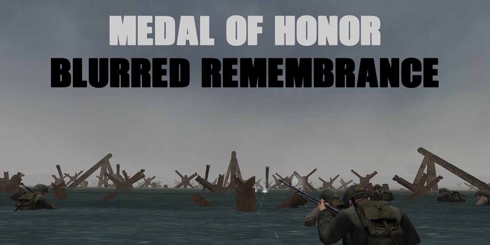
</a>  
    
### rPAM Development & CoD Multiplayer    

Get in touch if you wan't to help with rPAM & Multiplayer!    
There are always tasks or tests to be found.    
For my time already invested, you are welcome to leave a donation.    

> **Support this project via PayPal - Thank you!**    
> `Optional Donation` `(€)` `Billing Address Required`    
[***rPAM PayPal Donation Page***](https://www.paypal.com/donate/?hosted_button_id=NB3GC298ZMJG4) 

> **You can join CoDBASE-Discord to Play 5v5! See you there!**   
> `Call of Duty (2003) Multiplayer` `v1.5` `European playerbase`  
> [***Discord Invite Link***](https://discord.gg/Zh8DP7c)   

  
> [go up again](#news-and-updates) <|> [go next (Document Navigation)](#document-navigation)
---------------------------------------------------------------------------------------------
  

<!-- [Nav.] -->
<!-- [Nav.] -->
<!-- [Nav.] -->

# Document Navigation

**1.** [**About this Project**](#introduction)  

**3.** [**News And Updates**](#news-and-updates)

**2.** [**How To Support This Project**](#support-this-project)  

  

**4.** [**About rPAM Maps Overhaul**](#about-rpam-maps-overhaul)   

&nbsp;&nbsp;&nbsp;&nbsp;**4.1** [**Main Changes rPAM Maps Overhaul**](#main-changes-rpam-maps-overhaul)    
&nbsp;&nbsp;&nbsp;&nbsp;**4.8** [**Server Cvars rPAM Maps Overhaul**](#server-cvar-overview-rpam-maps-overhaul)  
&nbsp;&nbsp;&nbsp;&nbsp;**4.2** [**Actual Changelog**](#actual-changelog-rpam-maps-overhaul)    
&nbsp;&nbsp;&nbsp;&nbsp;**4.3** [**Main rPAM Maps**](#main-rpam-maps)    
&nbsp;&nbsp;&nbsp;&nbsp;**4.4** [**Featured Maps for Competitive Play**](#featured-maps-for-competitive-play)    
&nbsp;&nbsp;&nbsp;&nbsp;**4.5** [***All Available rPAM Maps***](#all-available-rpam-maps)    
&nbsp;&nbsp;&nbsp;&nbsp;**4.6** [**Maps Not Shown In The Game Menu**](#maps-not-shown-in-the-game-menu)      
&nbsp;&nbsp;&nbsp;&nbsp;**4.7** [**Detailed Changes On Custom Maps**](#changelog-rpam-maps-custom-detailed)    

&nbsp;&nbsp;&nbsp;&nbsp;**4.8** [***Server Cvars rPAM Maps Overhaul***](#server-cvar-overview-rpam-maps-overhaul)  

**5.** [**About rPAM Development**](#about-rpam-development)   

&nbsp;&nbsp;&nbsp;&nbsp;**5.1** [**Changes**](#svr-rpam-changes)  
&nbsp;&nbsp;&nbsp;&nbsp;**5.2** [**Changelog**](#svr-rpam-changelog)  
&nbsp;&nbsp;&nbsp;&nbsp;**5.3** [**SVR Cvars**](#svr-rpam-cvars)  
&nbsp;&nbsp;&nbsp;&nbsp;**5.4** [**Host SVR rPAM**](#host-svr-rpam)  
&nbsp;&nbsp;&nbsp;&nbsp;**5.5** [***Server Cvars rPAM Maps Overhaul***](#server-cvar-overview-rpam-maps-overhaul)  

**6.** [**TBA Gameplay Changes**](#tba-tba1)
  
&nbsp;&nbsp;&nbsp;&nbsp;**6.1** [**TBA Changes for Players**](#tba-tba2)  
&nbsp;&nbsp;&nbsp;&nbsp;**6.2** [**TBA Texture Changes Overview**](#changelog-all-textures)

**7.** [**Credits**](#credits)    
**8.** [**Programs Used**](#programs-used)  
**9.** [**Notes**](#notes)  
**3.** [**Downloads**](#download)  
**4.** [**Installation**](#installation) 

  
> [go up again](#document-navigation) <|> > [go next](#support-this-project)
---------------------------------------------------------------------------------------------
  

<!-- [4.] -->
<!-- [4.] -->
<!-- [4.] -->

# About rPAM Maps Overhaul

> Goals:

- Adaptations of all maps to rPAM and competitive play
- Revise and enhance ambient sounds, fog, and smoke effects on both classic and custom maps
- **Ensure compatibility with other mods, even without the rPAM-S&D for the server**
- Improve gameplay across all gametypes, minimize bugs and exploits

> **Supported Game Versions:**   
`Call of Duty Multiplayer v1.5`   
`Call of Duty Multiplayer v1.1 (Not tested yet)`

> [**Download Actual Version**](#download) 

> [**rPAM Maps Cvars**](#server-cvar-overview-rpam-maps-overhaul) 

  
> [go up again](#about-rpam-maps-overhaul) <|> [go up again (Document Navigation)](#document-navigation) <|> [go next](#main-changes-rpam-maps-overhaul)
---------------------------------------------------------------------------------------------
  

## Main Changes rPAM Maps Overhaul

> **Relevant to:** ``v2.2``

#### Ambient
- Normalized ambient sound effects for a more balanced audio volume `\soundaliases`
- Added rPAM Overhaul Script to change ambient sounds, fog and smoke plumes for competitive play `\maps\mp`

#### Textures
- Refreshed all levelshots `\levelshots`
- Updated HUD map layouts `\levelshots\layouts` of `default` (no layout available), `mp_harbor`, `mp_neuville`, `mp_stalingrad`, `mp_tigertown`
- Improved window glass transparency and frame details in `mp_neuville`
- Adjusted metal rail fences in `mp_carentan` for better visibility

#### Maps Added
- Added `mp_germantown` from Steiner (former german_town), used ingame now as `mp_germantown` with ``/rcon map mp_germantown``

- Added `Cod1 maps patch` from curiousfox 2025
  - Adds a updated ``mp_dawnville``, used ingame as `mp_dawnville_x` now with ``/rcon map mp_dawnville_x``
      - Axis spawn wall no longer affects player movement
      - Certain windows blocked to prevent prone-bug abuse
      - Graveyard bush wall is no longer see-through
      - Bombsite tanks remodeled for accurate hitboxes (fix should apply to all tanks in the game)
  - Adds a updated ``mp_railyard``, used ingame as  `mp_railyard_x` now with ``/rcon map mp_railyard_x``
    - Added loading screen and information in `rpam_msg`
      - Axis spawn wooden panels are now solid
      - ~~Raised the sky to prevent grenade disappearance~~ Nades still do disappear like before
      - S&D Tiger tanks remodeled to fix gaps (fix should apply to all tanks in the game)
      - Ruins faulty rock patched
      - Ruins stairs now use `+moveup` function when prone
      - Upper Axis ruins roof no longer see-through
        - Credits to Expertiz's earlier fix with the big woodgib
        - `v2` now does blend in the added object from curiousfox
        - `v3` now adds more objects for broken roof and broken wall textures

- Added aim maps available to play on each side: `mp_aim`, `mp_pgaim`, `mp_blaoaim`, `mp_wawa`

#### Added rPAM Overhaul Script For `mp_railyard`
`2024/25 by reissue` `**| AUTO OFF |**`     
The same locations like used in mp_railyard_x are edited by a script which does load insvisible objects and also visible objects with bullet-collision.
- The game does quickly overload by a huge amount of placed objects loaded by the script.
- I added commands to tinker around with different settings of the ["rPAM Overhaul Script For mp_railyard"](#rpam-overhaul-for-mp_railyard)
  <a href="images_readme/railyard_overhaul_script.png">
    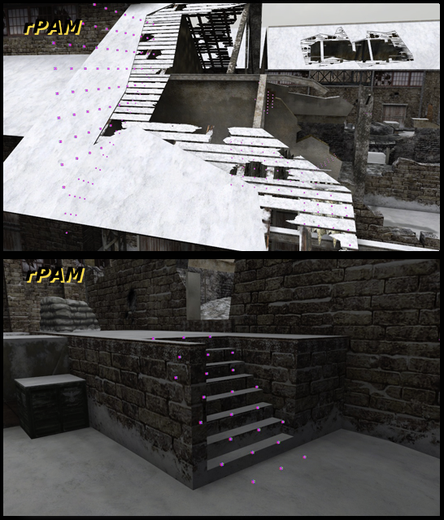
  </a>  
  

> **Relevant to:** ``v2.3``

- TBA
- TBA

  
> [go up again](#main-changes-rpam-maps-overhaul) <|> [go up again (Document Navigation)](#document-navigation) <|> [go next](#actual-changelog-rpam-maps-overhaul)
---------------------------------------------------------------------------------------------
  

# Actual Changelog rPAM Maps Overhaul

#### `v2.2` (Latest)
- Created server mod files for compatibility with other mods  
- Overhauled `.pk3` file name structure  
- Created this `README.md` in hopes it helps structuring the project  
- Added more objects from the rPAM `mp_railyard_x` overhaul script – it's now at version `v3`.
  - `mp_railyard_x` `ruins roof`: Filled a missing texture and a pixel-spot with bricks  
  <a href="images_readme/railyard_axis_roof1.png">
    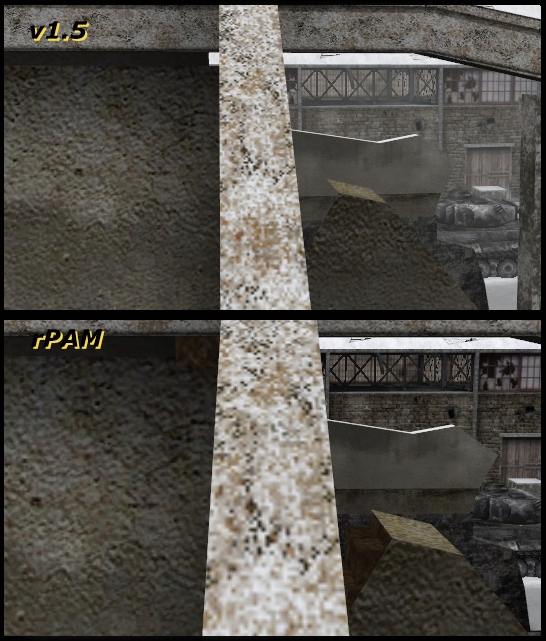
  </a>  

  - `mp_railyard_x` `ruins roof`: Added `woodgib_medium` to the lower roof section, and one to the top  
  <a href="images_readme/railyard_axis_roof3.png">
    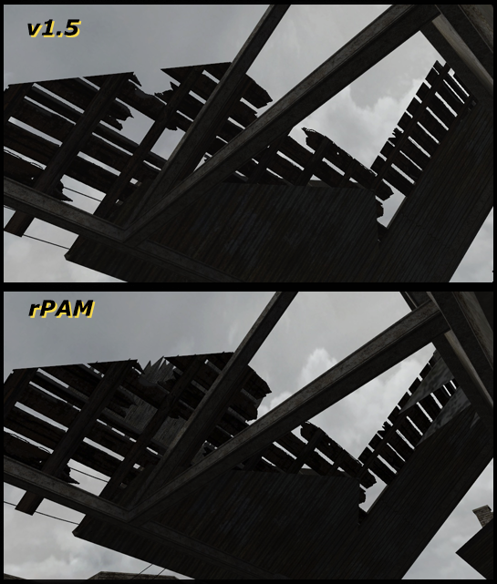
  </a>  

#### `v2.1`
- `mp_railyard_x` `ruins roof`: Moved object `bigwoodgib` at position `ruins roof` to blend into the surrounding structure  
  <a href="images_readme/railyard_axis_roof3.png">
    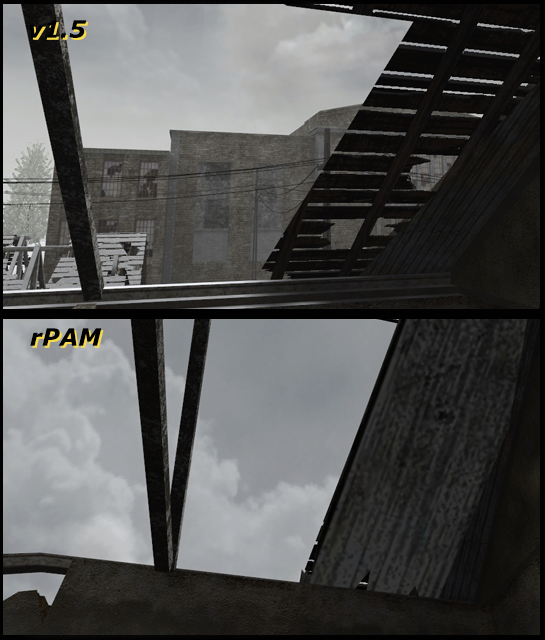
  </a>  
- Adjusted rock and ruins stairs – patch by *curiousfox*  
  <a href="images_readme/railyard_axis_roof3.png">
    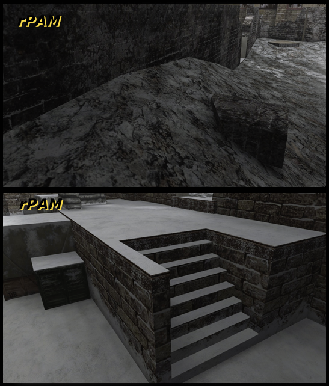
  </a>  

- Adjusted tank positions – patch by *curiousfox*  
  <a href="images_readme/railyard_axis_roof3.png">
    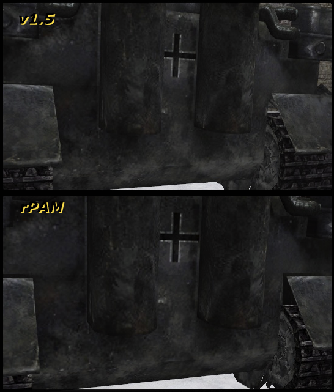
  </a>  

#### `v2.0`
- Edited `\textures\austria\transparents\metal_masked@ironfence1.dds` – DXT3
- Edited `\textures\austria\transparents\metal_masked@ironfence1a.dds` – DXT3
  - Now DXT5
  - Used in `mp_carentan`, for example  
  - Applies to all maps in the game  
  <a href="images_readme/carentan_fence_23.png">
    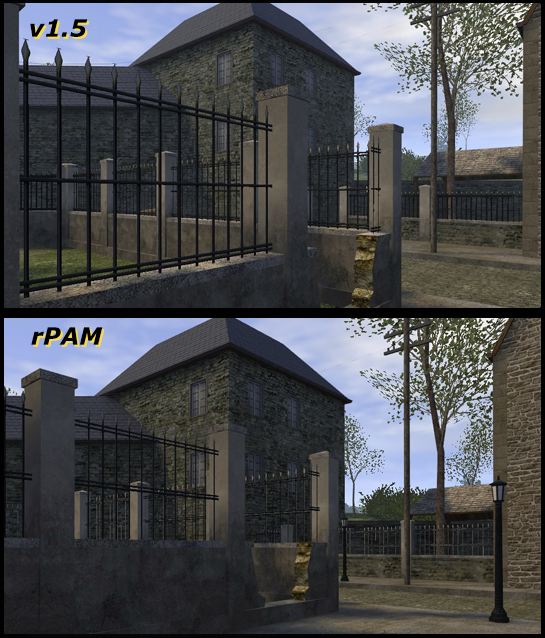
  </a>  

- Edited `\textures\normandy\windows\neuvilleglass.dds` – DXT3  
- Edited `\textures\normandy\windows\neuvilleframe.dds` – DXT5 (same as the DXT3 image)  
  - Used in `mp_neuville` and `mp_bonneville`, for example  
  - Adjusted glass transparency (alpha channel)  
  - Minor color corrections to the window frame  
  - Applies to all maps in the game  
  <a href="images_readme/neuville_windows.png">
    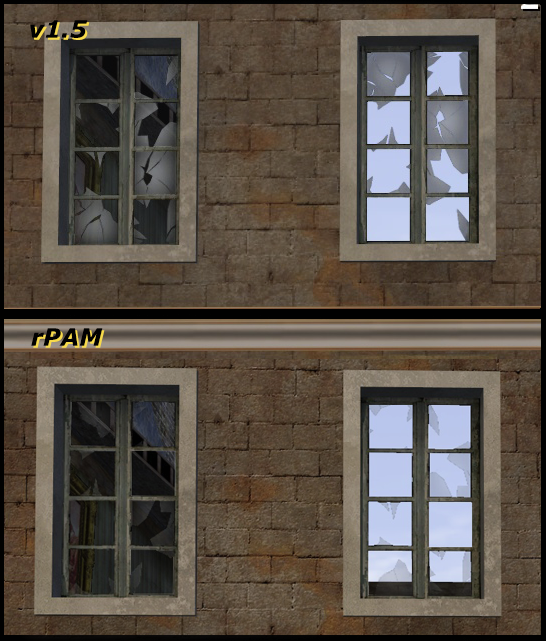
  </a>  

#### `v1.9`
- Completely overhauled ambient script (`soundaliases.csv`)  
- Reworked message center  
- Fixed compatibility issues with `.arena` files  
- Added aim maps to the mod  

#### `v1.8`
- Modified `.arena` files to prevent original map duplication  
- Normalized ambient audio (`\soundaliases\*.csv`)  
- Updated levelshots and layout images  
- Edited HUD map layouts:
  - `mp_harbor`
    - Switched A and B to match actual layout  
    - Adjusted midboxes  
  - `mp_neuville`, `mp_stalingrad`, `mp_tigertown`
    - Slightly enlarged & applied minor corrections  
  - `mp_germantown`
    - Added callouts and highlighted doorways  

#### `v1.7`
- Integrated all elements into working condition  
- Started adding and adapting more custom maps using the evolving script layout  

#### `v1.6`
- Added `Cod1 maps patch` by *curiousfox* (2025)  

#### `v1.5`
- Added maps and files for version 1.1 of the game  
- Included old aim maps with refreshed loading screens  
  - HUD map layout: default/unknown added (`\levelshots\layouts`)  
  - Changed texture for COD BASE on `wawa3Daim`  
- Added `german_town` from *Steiner* to the classic maps overhaul package  

#### `v1.4`
- Updated several levelshots  
- Created a mod package without the server mod included  

#### `v1.3`
- Experimented with fog effects and created related scripts  
- Updated ambient sound mod  

#### `v1.2`
- Collected all previously modded files  
- Established ambient sound mod based on rPAM v1.11  

  
> [go up again](#main-changes-rpam-maps-overhaul) <|> [go up again (Document Navigation)](#document-navigation) <|> [go next](#main-rpam-maps)
---------------------------------------------------------------------------------------------
  

# Main rPAM Maps

> **Relevant to:** ``v2.2`` [**Download**](#download) <|> [**rPAM-Cvars**](#rpam-maps-cvar-overview)

> **Supported Game Versions:**   
`Call of Duty Multiplayer v1.5`   
`Call of Duty Multiplayer v1.1 (Not testet yet)`

This is the in game map list for version 2.2 of rPAM Maps Overhaul:

| Map /rcon             | Creator                         | Gametypes                 | Side |
|-----------------------|---------------------------------|---------------------------|------|
| mp_brecourt           | Infinity Ward                   | dm, tdm, sd, re, bel, hq  | A    |
| mp_carentan           | Infinity Ward                   | dm, tdm, sd, re, bel, hq  | A    |
| mp_chateau            | Infinity Ward                   | dm, tdm,     re, bel, hq  | B    |
| mp_dawnville          | Infinity Ward                   | dm, tdm, sd, re, bel, hq  | A    |
| mp_dawnville_x        | IW + curiousfox [03-2025]       | dm, tdm, sd, re, bel, hq  | A    |
| mp_depot              | Infinity Ward                   | dm, tdm, sd, re, bel, hq  | B    |
| **mp_germantown**     | Steiner [03-2004]               | dm, tdm, sd,     bel      | A    |
| mp_harbor             | Infinity Ward                   | dm, tdm, sd, re, bel, hq  | R    |
| mp_hurtgen            | Infinity Ward                   | dm, tdm, sd, re, bel, hq  | A    |
| mp_pavlov             | Infinity Ward                   | dm, tdm, sd, re, bel, hq  | R    |
| mp_powcamp            | Infinity Ward                   | dm, tdm, re, sd, bel, hq  | R    |
| mp_railyard           | Infinity Ward                   | dm, tdm, sd, re, bel, hq  | R    |
| mp_railyard_x         | IW + curiousfox [03-2025]       | dm, tdm, sd, re, bel, hq  | R    |
| mp_rocket             | Infinity Ward                   | dm, tdm, sd, re, bel, hq  | B    |
| mp_ship               | Infinity Ward                   | dm, tdm,     re, bel, hq  | B    |
|                       |                                 |                           |      |
| mp_bocage             | added by offical patch 1.3      | dm, tdm, sd, re, bel, hq  | A    |
| mp_neuville           | added by offical patch 1.3      | dm, tdm, sd, re, bel, hq  | A    |
| mp_stalingrad         | added by offical patch 1.4      | dm, tdm, sd, re, bel, hq  | R    |
| mp_tigertown          | added by offical patch 1.5      | dm, tdm, sd, re, bel, hq  | A    |
|                       |                                 |                           |      |
| ***rPAM Aim Maps***   |                                 |                           |      |
| mp_aim_a              | Yannic [05-2004]                | dm, tdm                   | A    | 
| mp_aim_b              | Yannic [05-2004]                | dm, tdm                   | B    |  
| mp_aim_r              | Yannic [05-2004]                | dm, tdm                   | R    |  
| mp_blaoaim_a          | RL.GENERAL Z [08-2004]          | dm, tdm                   | A    |   
| mp_blaoaim_b          | RL.GENERAL Z [08-2004]          | dm, tdm                   | B    |   
| mp_blaoaim_r          | RL.GENERAL Z [08-2004]          | dm, tdm                   | R    |   
| mp_pgaim_a            | Unknown [04-2005]               | dm, tdm                   | A    |   
| mp_pgaim_r            | Unknown [04-2005]               | dm, tdm                   | R    |   
| mp_wawa_a             | wawa [07-2004]                  | dm                        | A    |  
| mp_wawa_b             | wawa [07-2004]                  | dm                        | B    |   
| mp_wawa_r             | wawa [07-2004]                  | dm                        | R    |  

  
> [go up again](#main-rpam-maps) <|> [go up again (Document Navigation)](#document-navigation) <|> [go next](#featured-maps-for-competitive-play)
---------------------------------------------------------------------------------------------
  

# Featured Maps for Competitive Play

> **Relevant to:** ``v2.3`` [**Download**](#download) <|> [**rPAM-Cvars**](#rpam-maps-cvar-overview)

> **Supported Game Versions:**   
`Call of Duty Multiplayer v1.5`   

  
> [go up again](#featured-maps-for-competitive-play) <|> [go up again (Document Navigation)](#document-navigation) <|> [go next](#all-available-rpam-maps)
---------------------------------------------------------------------------------------------
  

# All Available rPAM Maps

> **Relevant to:** ~~``Final``~~ [**Download**](#download) <|> [**rPAM-Cvars**](#rpam-maps-cvar-overview)

> **All Available rPAM Maplist**     
> [GITHUB LINK1](https://github.com/ANDROHKA/rpam-mod-for-vcod/blob/master/README_rpam_maplist_maps.md)

  
> [go up again](#all-available-rpam-maps) <|> [go up again (Document Navigation)](#document-navigation) <|> [go next](#maps-not-shown-in-the-game-menu)
---------------------------------------------------------------------------------------------
  

# Maps Not Shown In The Game Menu

> **All Available rPAM Maplist**     
> [GITHUB LINK1](https://github.com/ANDROHKA/rpam-mod-for-vcod/blob/master/README_rpam_maplist_maps.md)

  
> [go up again](#maps-not-shown-in-the-game-menu) <|> [go up again (Document Navigation)](#document-navigation) <|> [go next](#changelog-rpam-maps-custom-detailed)
---------------------------------------------------------------------------------------------
  

# Changelog rPAM Maps Custom Detailed

> **README rPAM Maps Detailed Changes**     
> [GITHUB LINK2](https://github.com/ANDROHKA/rpam-mod-for-vcod/blob/master/README_rpam_maps_detailed_changes.md

  
> [go up again](#changelog-rpam-maps-custom-detailed) <|> [go up again (Document Navigation)](#document-navigation) <|> [go next](#about-rpam-development)
---------------------------------------------------------------------------------------------
  

# About rPAM Development
- TBA

  
> [go up again](#about-rpam-development) <|> [go next](#svr-rpam-changes)
---------------------------------------------------------------------------------------------
  

# SVR rPAM Changes

  

## REISSUE LEANFIX

> **Relevant to:** ``v4``    
[**Download**](#download)

Full comparision between reissue-leanfix, expert-leanfix & default game.  
It’s remarkable how some people complain without really knowing what they’re talking about.

   
  
   
  
   
  

  
> [go up again](#svr-rpam-changes) <|> [go next](#svr-rpam-changelog)
---------------------------------------------------------------------------------------------
  

# SVR rPAM Changelog
- TBA

  
> [go up again](#svr-rpam-changelog) <|> [go next](#svr-rpam-cvars)
---------------------------------------------------------------------------------------------
  

# SVR rPAM Cvars
- TBA

  
> [go up again](#svr-rpam-cvars) <|> [go next](#host-svr-rpam)
---------------------------------------------------------------------------------------------
  

# Host SVR rPAM
- TBA

  
> [go up again](#host-svr-rpam) <|> [go up again (Document Navigation)](#document-navigation) <|> [go next](#server-cvar-overview-rpam-maps-overhaul)
---------------------------------------------------------------------------------------------
  

# Server Cvar Overview rPAM Maps Overhaul

- You can use `/rcon` within these commands
- You can use tab button to make complete commands

#### Ingame Mod Info Messages
- `rpam_msg` Displays actual settings when a maps starts
  - `1` = on **`|`** by default if not `g_gametype sd`
  - 0 = off
- `rpam_debug` Displays all settings for this mod for debugging
  - `0` = off **`|`** by default if not `g_gametype sd`
  - 1 = on

#### rPAM Ambient Settings
- `rpam_ambient_messagecenter`: Shows ambient info messages
  - `0` = off **`|`** by default since `rpam_msg` is used, older system
  - 1 = on
- `rpam_ambientsounds`: Enable ambient SFX
  - 0 = off
  - `1` = on **`|`** by default if not `g_gametype sd`
- `rpam_ambientfog`: Map-based fog
  - 0 = off (not available)
  - 1 = developer default settings
  - 2 = extended starting distance
  - `3` = extended starting distance and end distance **`|`** by default on each `g_gametype`
  - 4 = testing (if available)
  - 5 = setCullFog testing (if available)
- `rpam_ambientsmoke`: Map-based smoke plumes
  - `1` = on **`|`** by default if not `g_gametype sd`
  - 0 = off
 
#### rPAM Improvements
- `rpam_improvements`: Enables No-Prone Script by Roger Abrahamsson for all maps (`mp_stanjel`)
  - `1` = on **`|`** by default
  - 0 = off
- `rpam_overhaul` Enables rPAM Overhaul on `mp_railyard`
  - `0` = off **`|`** completely off by default
  - 1 = on **`|`** activates following commands below

#### rPAM Overhaul for mp_railyard
- `/rcon rpam_overhaul 1` and `/rcon map_restart` via Console enables rPAM Overhaul on *`mp_railyard`*
- `rpam_overhaul_messagecenter`: Show overhaul info `0`/`1`, Replaced by `rpam_msg`
- `railyard_add_decoration1`: Trees/trucks at Russian spawn `0`/`1`
- `railyard_add_decoration2`: Adds extra visuals `0`/`1`
- `railyard_fix_bombspots`: Fix bomb A/B gaps for S&D `0`/`1`
- `railyard_fix_woodstation_ruins`: Collision at Axis ruins `0`/`1`
- `railyard_fix_woodstation_spawn`: Spawn collision Axis `0`/`1`
- `railyard_fix_woodstation_roof`: Southern roof blocked `0`/`1`   
- `railyard_fix_ruins_roof`: Controls ruins roof access:
  - `0` = disabled
  - `1` = medium access
  - `2` = half blocked
  - `3` = limited access
  - `4` = full access
  - `5` = fully blocked
- `railyard_fix_ruins_stairs`: Improved stairs at A `0`/`1`
- `railyard_fix_ruins_stone`: Adds collision to small stone (Axis) `0`/`1`
- `railyard_block_southstation_roof`: Block ledge at Axis spawn `0`/`1`
- `railyard_block_updown`: Block ledge up/down by invisible height blocking (testing) `0`/`1`
- `xvar_rpam_overhaul_railyard`: Shows visual debug of all placed objects `0`/`1`
- *Maybe the coordinates could be useful in the future, or the up & down variant*

#### rPAM Overhaul disable
- `/rcon rpam_maps_disable 1` and `/rcon map_restart`
- `/rcon rpam_takeover 1` and `/rcon map_restart`

#### Automatic Setup
- `seta rpam_msg 1` if not `g_gametype sd`
- `seta rpam_ambientsounds 1` if not `g_gametype sd`
- `seta rpam_ambientfog 3`
- `seta rpam_ambientsmoke 1` if not `g_gametype sd`

  
> [go up again](#server-cvar-overview-rpam-maps-overhaul) <|> [go up again (Document Navigation)](#document-navigation) <|> [go next](#download)
---------------------------------------------------------------------------------------------
  

# Download    

> **Supported Game Version:** `Call of Duty Multiplayer` `v1.5`  
> **rPAM Version:** `TBA`  
> **rPAM Maps Version:** `v2.1`

- #### Actual version
	- 202t/0t/tt - <b><a href="about:blank">LINK-TBA1.zip</a></b>

- #### Version Tree
	- 202t/0t/tt - <b><a href="about:blank">LINK-TBA1.zip</a></b> (actual)
  - 202t/0t/tt - <b><a href="about:blank">LINK-TBA0.zip</a></b> (previous version)

  
> [go up again](#download) <|> [go up again (Document Navigation)](#document-navigation) <|> [go next](#mod-installation)
---------------------------------------------------------------------------------------------
  

# Mod Installation

**Relevant To:** `rPAM Maps Overhaul v2.2 b1``

***Server mod folder:*** `\Call of Duty\_rPAMv115*`

***Client mod folder:*** `\Call of Duty\_rPAMv115*`

***Mod files inside `\_rPAMv115*`:***
- `_run_rPAM.cmd`                            // Start the mod localy on your pc, try it out
- `_run_rPAM_debug.cmd`                      // Start the mod localy on your pc, try it out, get debug informations
- `_server_rpam.cfg`                         // For server hosts
- `description.txt`                          // Contains description for the ingame mod menu
- `z_svr_rPAMv115x_escamaps_v22_b1.pk3`      // For server hosts
- `zzzzz_rPAMv115maps_classics_base.pk3`
- `zzzzz_rPAMv115maps_classics_v17.pk3`
- `zzzzz_rPAMv115maps_curiousfox.pk3`
- `zzzzz_rPAMv115maps_curiousfox_v3.pk3`
- `zzzzz_rPAMv115x_aim_v4`
- `zzzzz_rPAMv115x_escamaps_v22_b1.pk3`

### Install Client:
- Go to `\Call of Duty\_rPAMv115``*` and run `_run_rPAM.cmd` to launch the game directly.
- Alternatively, start the Call of Duty Multiplayer normally and select `"rPAM Mod by reissue"` from the Mods menu.
- It is recommended to ensure that your `config_mp.cfg` settings are properly configured, as the file will be loaded from your `main` folder the first time you run the mod.

### Install Server:
- Add `seta fs_game "_rPAMv115*"` to your server config.
- Place the `_rPAMv115*` folder (with all mod files inside) next to the `main` folder in your Call of Duty game directory and also on your download ftp server.

### Recommendation:
- Players: Check or copy your `config_mp.cfg` from your `main` folder into the `_rPAMv115*` folder. Normally, it transfers automatically when launching the mod for the first time.
- Players: It is recommended you clear you `main` folder.
   - <a href="images_readme/cleared_main.png">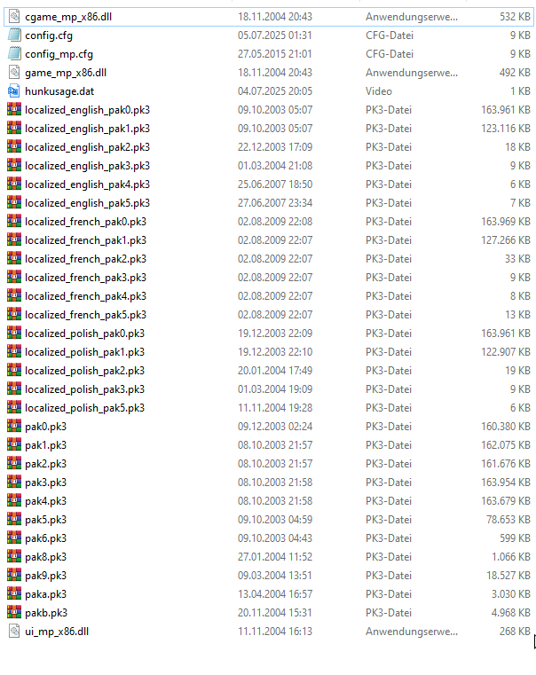 </a>
- Server Hosts: New players can download most of the required files directly by connecting to the game server by adding the following commands to the server config
`seta sv_allowDownload "1"`
`seta sv_wwwBaseURL "http://167.235.243.217/fastdl/cod1"` // Credits: bandiii92`
`seta sv_wwwDlDisconnected "1"`
`seta sv_wwwDownload "1"`

  
>  [go up again](#mod-installation) <|> [go up again (Document Navigation)](#document-navigation) <|> [go next](#all-credits)
---------------------------------------------------------------------------------------------
  

# All Credits

### Internet
- **bandiii92** - Hosting game files for players (2024)
- **CoDBase Discord Community** - Play 5v5 comp here: https://discord.gg/Zh8DP7c

### Maps
- **curiousfox** – Edited railyard and dawnville (2025)  
- **Expertiz** – Contributed fix for railyard ruins roof (2023)
- **Steiner** – Original `german_town` (2004)  
- **Roger Abrahamsson** - No-Prone Script (2005)
- **Yannic** - Custom map `mp_aim` (2004)
- **RL.GENERAL Z** - Custom map `rl_blaoaim` (2004)
- **wawa** - Custom map `wawa3DAim` (2004)
- **Unknown Creator(s)** - Custom map `pg_aim` (2005), `TBA` (2005), (2005), (2005), (2005), (2005),

### Creator Of rPAM
- **reissue** - rPAM & Origin of Honor Project

  
> [go up again (Document Navigation)](#document-navigation) <|> [go next](#news-from-the-headquaters)
---------------------------------------------------------------------------------------------
  

  
> [go up again](#credits) <|> [go up again (Document Navigation)](#document-navigation) <|> [go next](#programs-used)
---------------------------------------------------------------------------------------------
  

# Programs Used
- WinMerge, VSCode, txt-Editor, WinRar, 7-Zip, Github, XNView
- CoD1 Radiant
- DXT Viewer, Photoshop, Gimp, .dds-plugins
- Audacity
- CoD BSP Editor by kartjom: https://github.com/kartjom/CoD-BSP-Editor

  
> [go up again](#programs-used) <|> [go up again (Document Navigation)](#document-navigation) <|> [go next](#notes)
---------------------------------------------------------------------------------------------
  

# Notes

If anything is incorrect or unclear, please let me know. Thank you.

Discord: REISSUE (discord: REISSUE, androhka#6116)

  
> [go up again](#notes) <|> [go up again (Document Navigation)](#document-navigation) <|> [go next](#changelog-all-textures)
---------------------------------------------------------------------------------------------
  

# Changelog All Textures
- TBA

  
> [go up again](#changelog-all-textures) <|> [go up again (Document Navigation)](#document-navigation)
---------------------------------------------------------------------------------------------
  

## END
