# All Available rPAM Maps

> **Relevant to:** ~~``Final``~~ [**Download**](#download) <|> [**rPAM-Cvars**](#rpam-maps-cvar-overview)

> **Supported Game Versions:**   
>`Call of Duty Multiplayer v1.5`  
>~~`Call of Duty Multiplayer v1.1`~~   

The following shows all multiplayer maps displayed in the in-game "Create Server" menu.
All scripts has been touched.
  

> [Go to **Maps Not Shown In The Game Menu** (go next)](#maps-not-shown-in-the-game-menu) 

| Slot  | Map `/rcon`                   | Creator                                            | Gametypes                        | Side | Notes                           |
|-------|-------------------------------|----------------------------------------------------|----------------------------------|------|---------------------------------|
|       | ***Classic Maps***            |                                                    |                                  |      |                                 |
| 01    | mp_brecourt                   | Infinity Ward                                      | dm, tdm, sd, re, bel, hq         | A    |                                 |
| 02    | mp_carentan                   | Infinity Ward                                      | dm, tdm, sd, re, bel, hq         | A    |                                 |
|       | ~~mp_chateau~~                | Infinity Ward                                      | dm, tdm,     re, bel, hq         | B    |                                 |
|       | ~~mp_dawnville~~              | Infinity Ward                                      | dm, tdm, sd, re, bel, hq         | A    |                                 |
| 03    | mp_dawnville_x                | Infinity Ward + curiousfox [03-2025]               | dm, tdm, sd, re, bel, hq         | A    | *Has fixes*                     |
| 04    | mp_depot                      | Infinity Ward                                      | dm, tdm, sd, re, bel, hq         | B    |                                 |
| 05    | mp_harbor                     | Infinity Ward                                      | dm, tdm, sd, re, bel, hq         | R    |                                 |
| 06    | mp_hurtgen                    | Infinity Ward                                      | dm, tdm, sd, re, bel, hq         | A    |                                 |
| 07    | mp_pavlov                     | Infinity Ward                                      | dm, tdm, sd, re, bel, hq         | R    |                                 |
| 08    | mp_pegasusnight               | Infinity Ward                                      | dm, tdm                          | B    | *S&D may be added*              |
| 09    | mp_pegasusday                 | Infinity Ward                                      | dm, tdm                          | B    | *S&D may be added*              |
| 10    | mp_powcamp                    | Infinity Ward                                      | dm, tdm, sd, re, bel, hq         | R    |                                 |
|       | ~~mp_railyard~~               | Infinity Ward                                      | dm, tdm, sd, re, bel, hq         | R    | *Has fixes*                     |
| 11    | mp_railyard_x                 | Infinity Ward + curiousfox [03-2025]               | dm, tdm, sd, re, bel, hq         | R    |                                 |
| 12    | mp_rocket                     | Infinity Ward                                      | dm, tdm, sd, re, bel, hq         | B    |                                 |
|       | ~~mp_ship~~                   | Infinity Ward                                      | dm, tdm, sd, re,      hq         | B    |                                 |
| 13    | mp_bocage                     | Infinity Ward, added by patch 1.3                  | dm, tdm, sd, re, bel, hq         | A    |                                 |
| 14    | mp_neuville                   | Infinity Ward, added by patch 1.3                  | dm, tdm, sd, re, bel, hq         | A    |                                 |
| 15    | mp_stalingrad                 | Infinity Ward, added by patch 1.4                  | dm, tdm, sd, re, bel, hq         | R    |                                 |
| 16    | mp_tigertown                  | Infinity Ward, added by patch 1.5                  | dm, tdm, sd, re, bel, hq         | A    |                                 |
|       |                               |                                                    |                                  |      |                                 |
| 17    | ***>> rPAM CUSTOM***          |                                                    |                                  |      |                                 |
| 18    | mp_abbey                      | FORCE316 [10-2004]                                 | dm, tdm, sd, re, bel, hq         | A    |                                 |
| 19    | mp_amfreville                 | Steppenwolf & THE DUKE [04-2005]                   | dm, tdm, sd, re, hq              | A    | Large sized map                 |
| 20    | mp_aquitaine                  | rasta [06-2005]                                    | dm, tdm, sd                      | B    | *Beta*                          |
| 21    | mp_bazolles                   | Magnus Sandström & Roger Abrahamsson [07-2004]     | dm, tdm, sd, re, bel, hq         | A    |                                 |
| 22    | **mp_beauville**              | IxQue [03-2004], *edited by reissue_*              | dm, tdm, **sd**, bel, hq         | A    | ***S&D added***                 |
| 23    | mp_bellicourt                 | Magnus Sandström & Roger Abrahamsson [03-2004]     | dm, tdm, sd, re, bel, hq         | A    | *Different to night ver.*       |
| 24    | mp_bellicourt_night           | Magnus Sandström & Roger Abrahamsson [04-2004]     | dm, tdm, sd, re, bel, hq         | A    | *Fixed version used             |
| 25    | mp_daybreak                   | Mj & Cypher [10-2005]                              | dm, tdm, sd, re, bel             | A    | Large sized map *V 2.0 used*    |
| 26    | mp_dday7                      | [AYM] Lt Jules [06-2004]                           | dm, tdm, sd,     bel, hq         | A    |                                 |
| 27    | mp_dufresne                   | -HG- Baby Seal Clubber [08-2004]                   | dm, tdm, sd, re, bel, hq         | A    |                                 |
| 28    | mp_falaisevilla               | colpe [01-2004] & shitman [10-2009]                | dm, tdm, sd, re, bel, hq         | A    |                                 |
| 29    | mp_germantown                 | Steiner [03-2004]                                  | dm, tdm, sd,     bel             | A    |                                 |
| 30    | mp_hanoi                      | Expertiz & DigitalDials [12-2016]                  | dm, tdm, sd, re, bel             | A    |                                 |
| 31    | mp_hurtgen_autumn             | IW + 3FJTACTICAL [12-2004]                         | dm, tdm, sd, re, bel, hq         | A    |                                 |
| 32    | mp_junobeach                  | [126th] Televinken [12-2004]                       | dm, tdm, sd, re, bel, hq         | B    | *Morsers deactivated*           |
| 33    | mp_merderet_river             | Steppenwolf [04-2005]                              | dm, tdm, sd, re, bel, hq         | A    | Extra large map *Ed. textures*  |
| 34    | mp_merville_battery           | [HOLY] Moses [07-2004]                             |     tdm, sd,          hq         | B    | *DM may be added*               |
|       | ~~mp_nuenen~~                 | [AYM] Lt Jules                                     | dm, tdm, sd,     bel, hq         | A    | *Broken windows*                |
| 35    | mp_priory                     | Filbert [08-2006]                                  | dm, tdm, sd,     bel, hq         | B    |                                 |
| 36    | mp_redoktober                 | Drecks, Lex & Innocent Bystander [09-2004]         | dm, tdm, sd,     bel, hq         | R    | Extra Large map                 |
| 37    | mp_stanjel                    | Roger Abrahamsson [04-2006]                        | dm, tdm, sd, re, bel, hq         | R    |                                 |
| 38    | mp_stcomedumont               | maverick & Lt.J.Snellius [02-2005]                 | dm, tdm, sd, re, bel, hq         | A    | Large sized map                 |
| 39    | mp_steny                      | Spik3d [07-2007]                                   | dm, tdm, sd,     bel, hq         | A    |                                 |
| 40    | mp_subharbor_day              | VegaObscura [03-2004]                              | dm, tdm, sd,     bel, hq         | B    | Large sized map                 |
|       | ~~mp_subharbor_night~~        | VegaObscura [03-2004]                              | dm, tdm, sd,     bel, hq         | B    | *Day allready present*          |
| 41    | mp_trenchville                | S.C. [07-2005]                                     | dm, tdm, sd,     bel             | A    |                                 |
| 42    | mp_varaville                  | IW + Slyk & Innocent Bystander [04-2004]           | dm, tdm,         bel             | A    | Extra Large map                 |
| 43    | mp_westwall                   | sm0k3r [12-2003]                                   | dm, tdm, sd, re, bel, hq         | B    | *Is really dark*                |
| 44    | mp_windmills                  | VegaObscura [05-2004]                              | dm, tdm, sd, re, bel             | A    | Large sized map                 |
|       |                               |                                                    |                                  |      |                                 |
|       | ***>> rPAM CUSTOM Winter***   |                                                    |                                  |      |                                 |
| 45    | mp_brecourt_winter            | -OCG-=gLiTcH= [08-2004]                            | dm, tdm, sd, re, bel, hq         | A    |                                 |
| 46    | mp_bonneville                 | [CF] WillyWonka [07-2004]                          | dm, tdm, sd,     bel             | A    | *Out of bounds not fixed yet*   |
| 47    | mp_container                  | openf1re [06-2004]                                 |     tdm, sd                      | R    | *DM needs to be added*          |
|       | ~~mp_dufresne_winter~~        | [HG] Baby Seal Clubber [08-2004]                   | dm, tdm, sd, re, bel, hq         | A    | *Summer a. present*             |
| 48    | mp_eisberg                    | Fangio [12-2003]                                   | dm, tdm, sd,     bel             | B    | Small sized map                 |
| 49    | mp_frozen                     | SIFFER [02-2004]                                   | dm, tdm,     re, bel             | B    | Small sized map                 |
| 50    | mp_harbor_gg                  | IW + TheGoog [06-2021]                             | dm, tdm, sd, re, bel, hq         | R    |                                 |
| 51    | mp_logging_mill               | Dex [06-2007]                                      | dm, tdm, sd, re, bel             | R    | Small sized map *1.1 used*      |
| 52    | mp_maaloy                     | [126th] Televinken [12-2004]                       | dm, tdm, sd, re, bel, hq         | B    |                                 |
| 53    | mp_miniharbor                 | IW + TheGoog & JtGz [05-2025]                      | dm, tdm, sd                      | R    | Small sized map                 |
| 54    | mp_offensive                  | Old-Crow & Caskou [02-2004]                        | dm, tdm, sd, re, bel, hq         | A    |                                 |
| 55    | mp_univermag                  | Drecks & Innocent Bystander [02-2004]              | dm, tdm, sd,     bel, hq         | R    | Large sized map                 |
| 56    | mp_valley_day                 | VegaObscura [03-2004]                              | dm, tdm, sd,     bel             | A    | Large sized map                 |
|       | ~~mp_valley_night~~           | VegaObscura [03-2004]                              | dm, tdm, sd,     bel             | A    | *Day allready present*          |
| 57    | mp_winterambush               | Unknown [03-2006]                                  | dm, tdm, sd                      | A    | Small sized map                 |
|       |                               |                                                    |                                  |      |                                 |
| 58    | ***>> Blurred Remembrance***  |                                                    |                                  |      |                                 |
| 59    | mp_brest                      | VikingWiedel [09-2004]                             | dm, tdm,         bel             | A    | Small sized map                 |
| 60    | mp_bridge                     | [tFp] CFH666 [09-2004]                             | dm, tdm, sd,          hq         | B    |                                 |
| 61    | mp_bridge_a                   | VikingWiedel [08-2004]                             | dm, tdm, sd,     bel             | A    | *SD ver.*                       |
|       | mp_bridge_beta                | VikingWiedel [06-2004]                             | dm, tdm,         bel             | A    | *Beta ver., Less rooms*         |
| 62    | mp_destroyed_village          | -OCG-=gLiTcH= [05-2005]                            | dm, tdm, sd, re, bel, hq         | A    | *Has rpam edited textures*      |
| 63    | mp_hunt                       | [tFp] Daryl Strawberry [08-2004]                   | dm, tdm, sd,                     | A    |                                 |
|       | ~~mp_remagen~~                | nash [08-2004]                                     | dm, tdm,     re, bel             | A    | *Breakable Windows*             |
| 64    | mp_rocket_facility            | -TFO- Kilroy [02-2004]                             | dm, tdm, sd, re, bel, hq         | A    | *Openable doors*                |

# Maps Not Shown In The Game Menu

> **Relevant to:** ~~``Maps v2.3 onwards``~~

The following multiplayer maps are not shown in the in-game "Create Server" menu. However you can use `/rcon` or the server map rotation in your `server.cfg` to play these.
- Crossed-out maps may be included here!
        

> [Go to **All Available Maps In The Game Menu** (go up again)](#all-available-rpam-maps) 

| Slot  | Map `/rcon`                  | Creator                                            | Gametypes                        | Side | Notes                           |
|-------|------------------------------|----------------------------------------------------|----------------------------------|------|---------------------------------|
| 65    | ***Hidden Aim Maps***        |                                                    |                                  |      |                                 |
| 66    | mp_aim_a                     | Yannic [05-2004]                                   | dm, tdm                          | A    |                                 |
| 67    | mp_aim_b                     | Yannic [05-2004]                                   | dm, tdm                          | B    |                                 |
| 68    | mp_aim_r                     | Yannic [05-2004]                                   | dm, tdm                          | R    |                                 |
| 69    | mp_blaoaim_a                 | RL.GENERAL Z [08-2004]                             | dm, tdm                          | A    |                                 |
| 70    | mp_blaoaim_b                 | RL.GENERAL Z [08-2004]                             | dm, tdm                          | B    |                                 |
| 71    | mp_blaoaim_r                 | RL.GENERAL Z [08-2004]                             | dm, tdm                          | R    |                                 |
| 72    | mp_pgaim_a                   | Unknown [04-2005]                                  | dm, tdm                          | A    |                                 |
| 73    | mp_pgaim_r                   | Unknown [04-2005]                                  | dm, tdm                          | R    |                                 |
| 74    | mp_wawa_a                    | wawa [07-2004]                                     | dm                               | A    |                                 |
| 75    | mp_wawa_b                    | wawa [07-2004]                                     | dm                               | B    |                                 |
| 76    | mp_wawa_r                    | wawa [07-2004]                                     | dm                               | R    |                                 |
|       |                              |                                                    |                                  |      |                                 |
|       | ***Hidden Custom Maps***     |                                                    |                                  |      |                                 |
| 77    | mp_frozen_a                  | SIFFER [02-2004]                                   | dm, tdm,     re, bel             | A    |                                 |
| 78    | mp_frozen_r                  | SIFFER [02-2004]                                   | dm, tdm,     re, bel             | R    |                                 |
| 79    | mp_bellicourt_night_beta     | Magnus Sandström & Roger Abrahamsson [04-2004]     | dm, tdm, sd, re, bel, hq         | A    | *Version before fix*            |
| 80    | mp_nuenen                    | [AYM] Lt Jules                                     | dm, tdm, sd,     bel, hq         | A    | *Broken windows*                |
| 81    | mp_subharbor_night           | VegaObscura [03-2004]                              | dm, tdm, sd,     bel, hq         | B    | *Day allr. present*             |
| 82    | mp_valley_night              | VegaObscura [03-2004]                              | dm, tdm, sd,     bel             | A    | *Day allr. present*             |
| 83    | mp_bridge_beta               | VikingWiedel [06-2004]                             | dm, tdm,         bel             | A    | *Beta Ver, Smaller*             |
|       |                              |                                                    |                                  |      |                                 |
|       | ***Hidden Cassics***         |                                                    |                                  |      |                                 |
| 84    | mp_chateau                   | Infinity Ward                                      | dm, tdm,     re, bel, hq         | B    |                                 |
| 85    | mp_dawnville                 | Infinity Ward                                      | dm, tdm, sd, re, bel, hq         | A    |                                 |
| 86    | mp_railyard                  | Infinity Ward                                      | dm, tdm, sd, re, bel, hq         | R    |                                 |
| 87    | mp_ship                      | Infinity Ward                                      | dm, tdm,     re, bel, hq         | B    |                                 |

# Changelog rPAM Maps Custom Detailed

 
> **Relevant to:** ``v2.2``

> **Supported Game Versions:**   
`Call of Duty Multiplayer v1.5`   
`Call of Duty Multiplayer v1.1 (Not testet yet)`

## ***Changes On Custom Maps***  

> &nbsp; **Entry:**  29   
> &nbsp; **Changes on `mp_germantown` made by Steiner [03-2004]**  
- known as `german_town` `german_town.pk3`  
- HUD map layout edited and overhauled to match the game scheme `\levelshots\layouts`  
- Updated levelshot `\levelshots`   
 
 

> &nbsp; **Final Entry:**  66, 67, 68     
> &nbsp; **Changes on `mp_aim` made by Yannic [05-2004]**
- known as `mp_aim with basharena` `mp_aim.pk3`
- HUD map layout default/unknown added `\levelshots\layouts`
- Updated levelshot `\levelshots`   
 
 
 
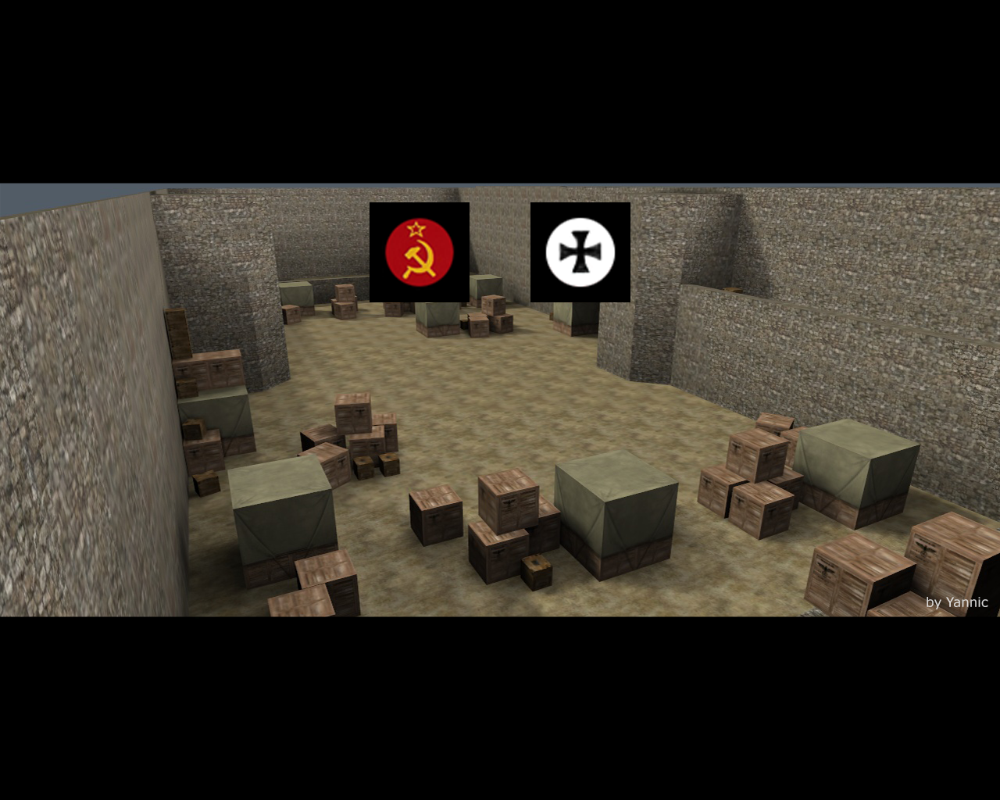 

> &nbsp; **Final Slot::**  69, 70, 71    
> &nbsp; **Changes on `mp_blaoaim` by RL.GENERAL Z [08-2004]**
- known as `rl_blaoaim` `original filename missing`
- HUD map layout default/unknown added `\levelshots\layouts`
- changed a texture to promote CODBASE
- Updated levelshot `\levelshots`   
 
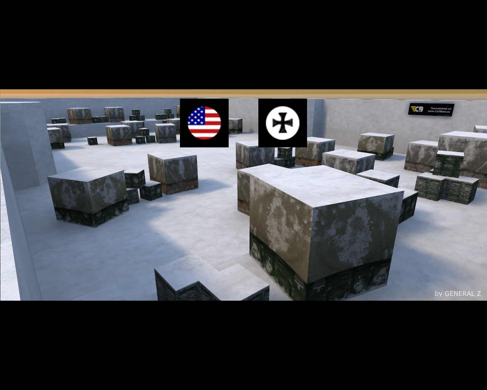 
 
 

> &nbsp; **Final Entry:**  72 & 73  
> &nbsp; **Changes on `mp_pgaim` by an unknown author [05-2004]**
- known as `pg_aim` `pg_aim.pk3`
- HUD map layout default/unknown added `\levelshots\layouts`
- mp_pgaim_b british is crashing the game
- Updated levelshot `\levelshots`   
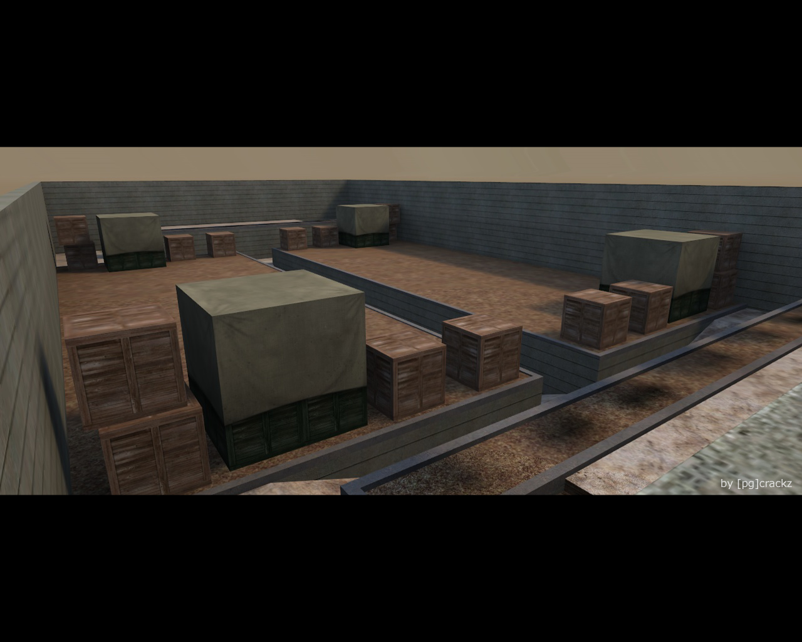 
 
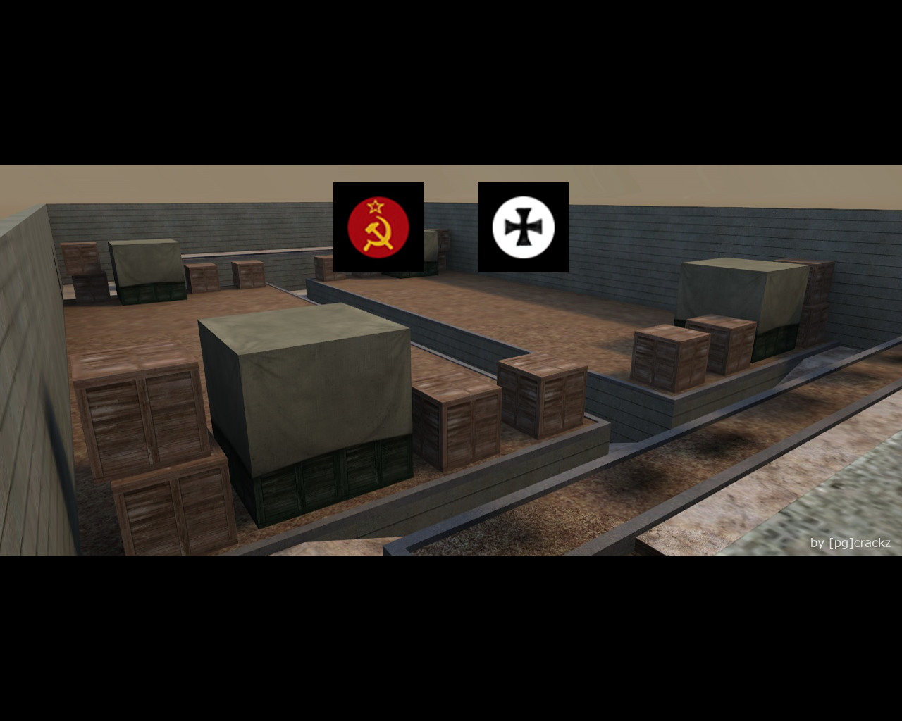 

> &nbsp; **Final Entry:**  74, 75, 76   
> &nbsp; **Changes on `mp_wawa` by wawa [07-2004]**    
- known as `wawa_3Daim` `wawa_3dAim.pk3`
- HUD map layout default/unknown added `\levelshots\layouts`
- removed any script so that g_gametype dm is working
- changed a texture to promote CODBASE
- Updated levelshot `\levelshots`   
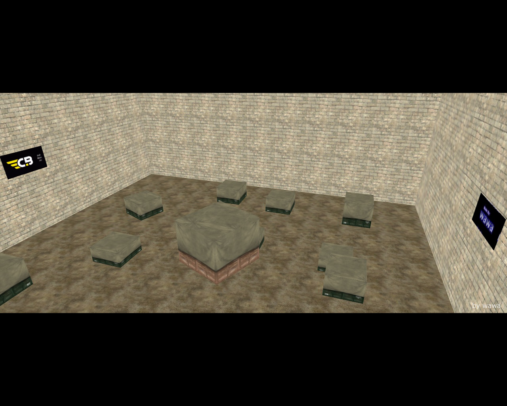 
 
 
 

  
### ***More Changes***   

> **Relevant To Version:** ~~`Final`~~   
> **Supported Game Versions:** `Call of Duty Multiplayer v1.5`  

The following will be relevant to several versions.

> &nbsp; **Entry:**  18     
> &nbsp; **Changes on `mp_abbey` made by FORCE316 [10-2004]**
- known as `mp_abbey` `ctf_abbey` `original filename missing` 
- HUD map layout edited and overhauled to match the game scheme	`\levelshots\layouts`    
- Updated levelshot `\levelshots`    
 
 

> &nbsp; **Entry:**  19     
> &nbsp; **Changes on `mp_amfreville` made by Steppenwolf & THE DUKE [04-2005]**
- known as `mp_amfreville`    
- HUD map layout edited and overhauled to match the game scheme	`\levelshots\layouts`    
- Updated levelshot `\levelshots`    
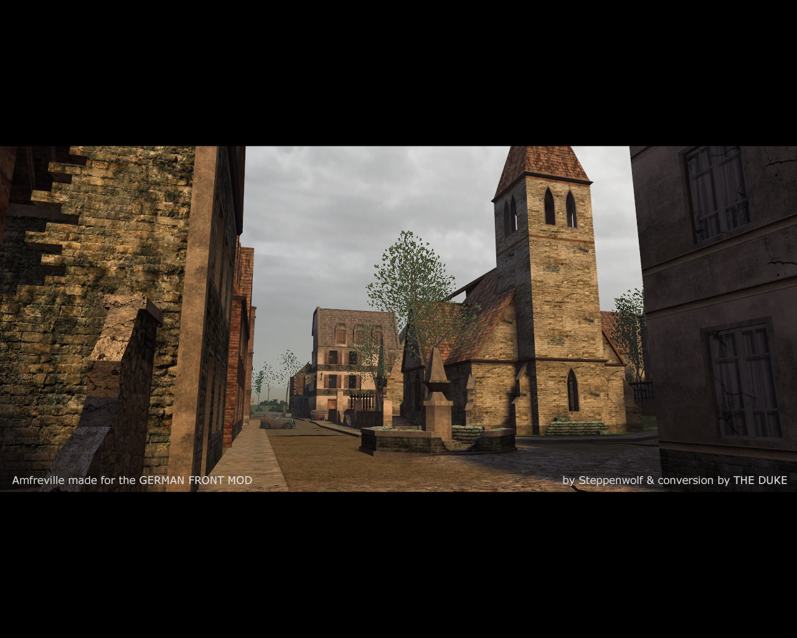 
 
 

> &nbsp; **Entry:**  20  
> &nbsp; **Changes on `mp_aquitaine` made by rasta [06-2005]**
- known as `mp_aquitaine`
- HUD map layout edited and overhauled to match the game scheme	`\levelshots\layouts`    
- Updated levelshot `\levelshots`    
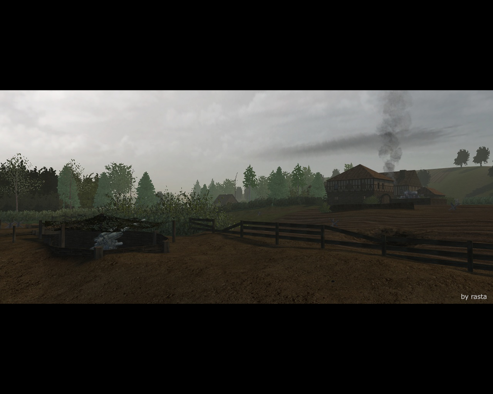 
 

> &nbsp; **Entry:**  21   
> &nbsp; **Changes on `mp_bazolles` made by Magnus Sandström & Roger Abrahamsson [07-2004]**
- known as `mp_bazolles`
- HUD map layout edited and overhauled to match the game scheme	`\levelshots\layouts`    
- Updated levelshot `\levelshots`  
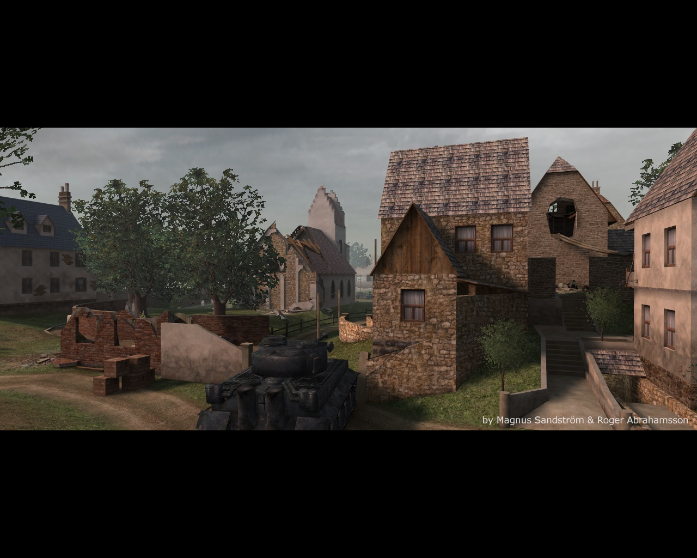 
 

> &nbsp; **Entry:**  22 
> &nbsp; **Changes on `mp_beauville` made by IxQue [03-2004], edited by reissue_**
- known as `mp_beauville`
- HUD map layout edited and overhauled to match the game scheme	`\levelshots\layouts`    
- Updated levelshot `\levelshots`  
 
 

> &nbsp; **Entry:**  23 & 24 (& 79 beta)    
> &nbsp; **Changes on `mp_bellicourt` [03-2004] & `bellicourt_night` [04-2004]   
> &nbsp; made by Magnus Sandström & Roger Abrahamsson**
- known as `mp_bellicourt_fix`
- HUD map layout edited and overhauled to match the game scheme	`\levelshots\layouts`    
- Updated levelshot `\levelshots`  
 
 
 
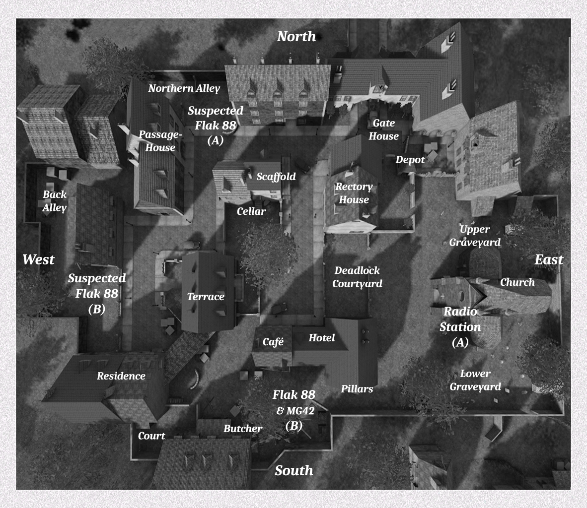 

> &nbsp; **Entry:**  25    
> &nbsp; **Changes on `mp_daybreak` made by Mj [10-2005]**
- known as `mp_daybreak`
- HUD map layout edited and overhauled to match the game scheme	`\levelshots\layouts`    
- Updated levelshot `\levelshots`  
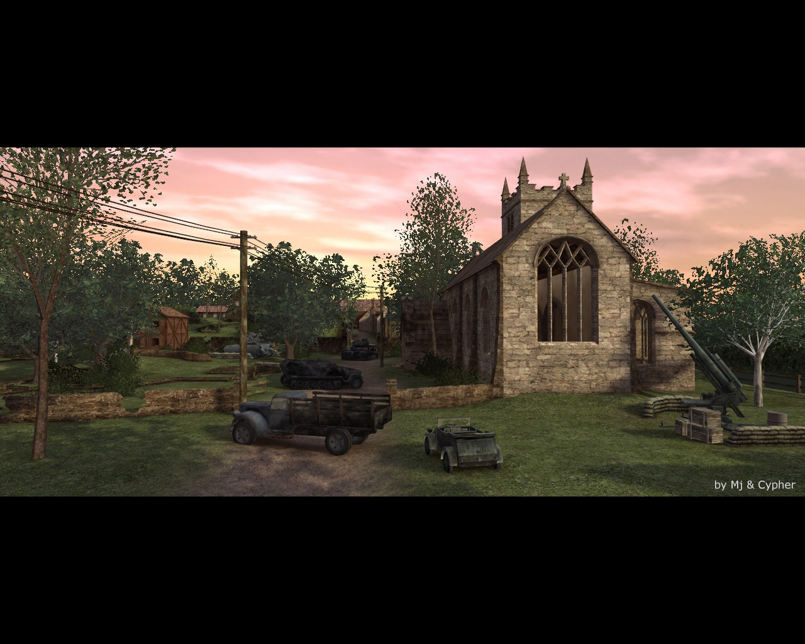 
 

> &nbsp; **Entry:**  26     
> &nbsp; **Changes on `mp_dday7` made by [AYM] Lt Jules [06-2004]**
- known as `mp_dday7`
- HUD map layout edited and overhauled to match the game scheme	`\levelshots\layouts`    
- Updated levelshot `\levelshots`  
 
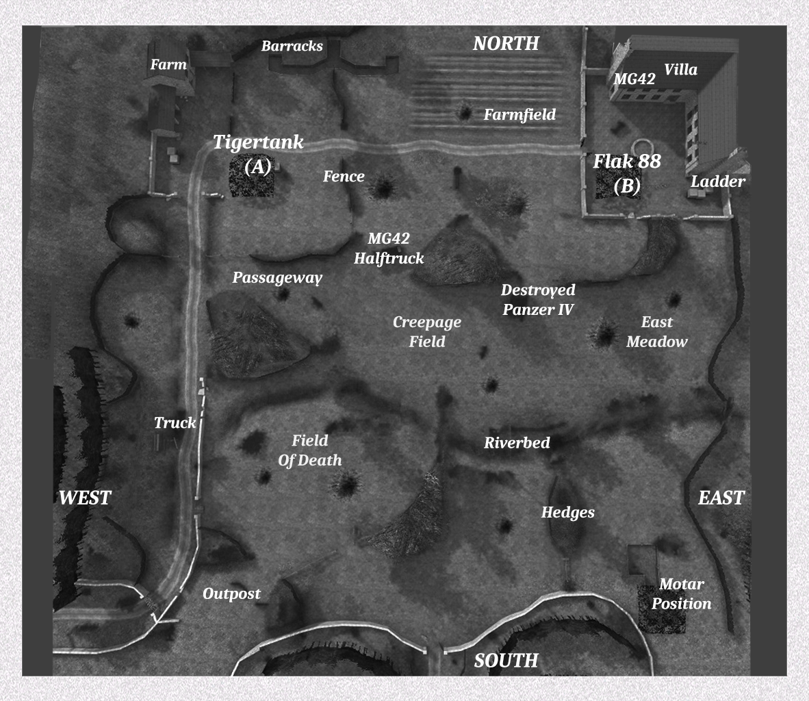 

> &nbsp; **Entry:**  27     
> &nbsp; **Changes on `mp_dufresne` made by -HG- Baby Seal Clubber [08-2004]**
- known as `mp_dufresne`
- HUD map layout edited and overhauled to match the game scheme	`\levelshots\layouts`    
- Updated levelshot `\levelshots`  
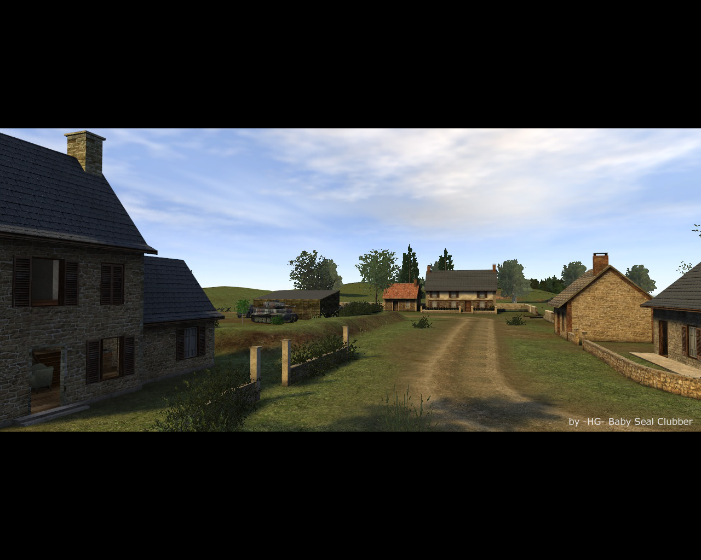 
 
 

> &nbsp; **Entry:**  28     
> &nbsp; **Changes on `mp_falaise_villa` made by colpe [01-2004] & edited by shitman [10-2009]**
- known as `mp_falaise_villa`
- HUD map layout edited and overhauled to match the game scheme	`\levelshots\layouts`    
- Updated levelshot `\levelshots`  
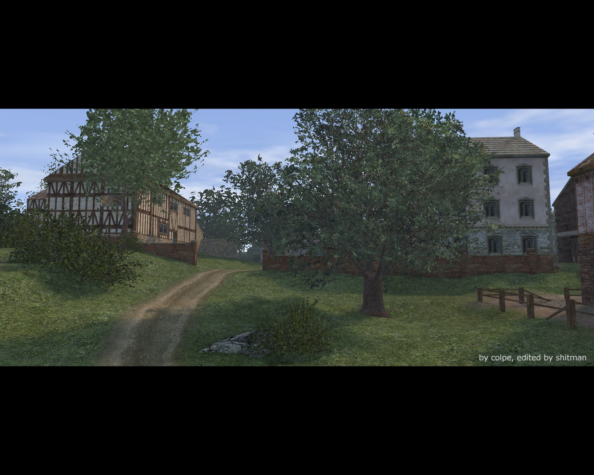 
 

> &nbsp; **Entry:**  29 is `mp_germantown`  

> &nbsp; **Entry:**  30   
> &nbsp; **Changes on `mp_hanoi` made Expertiz & DigitalDials [12-2016]**
- known as `mp_hanoi`
- HUD map layout edited and overhauled to match the game scheme	`\levelshots\layouts`    
- Updated levelshot `\levelshots`  
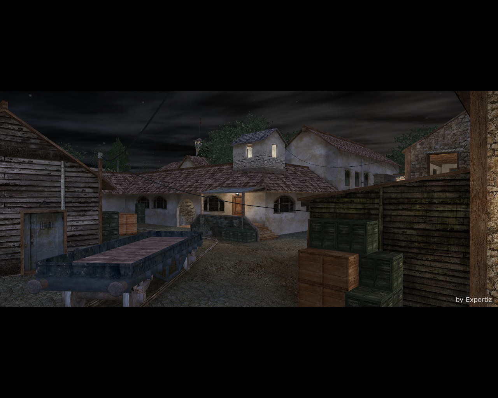 
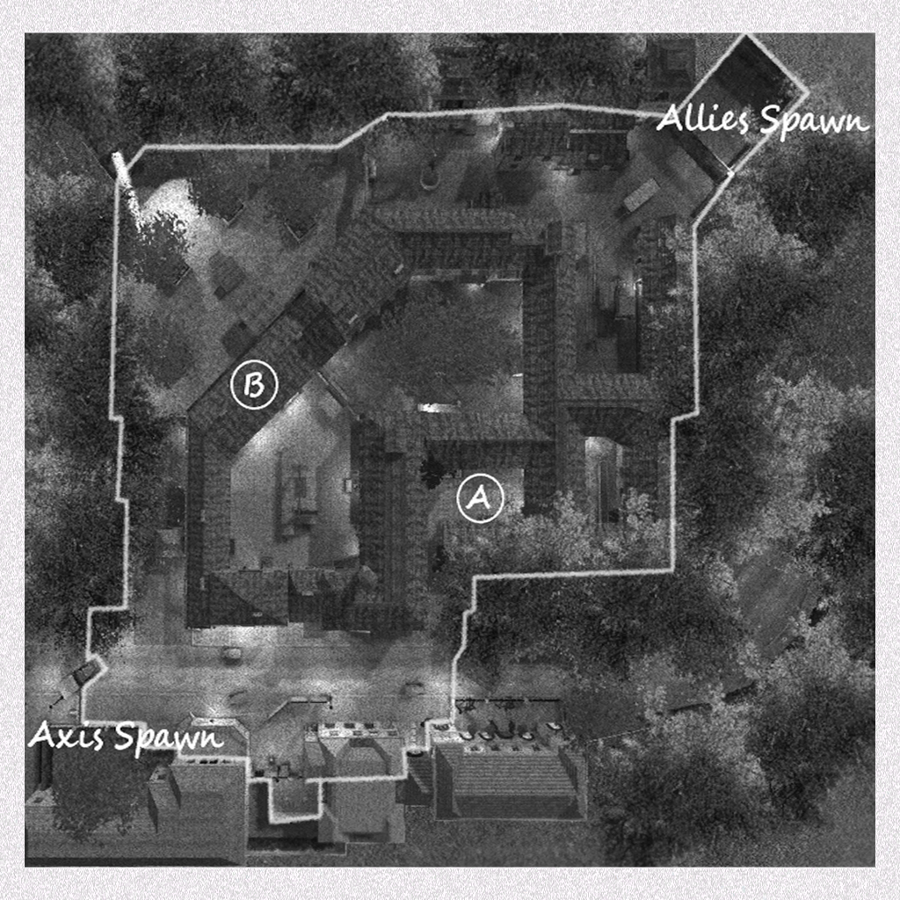 

> &nbsp; **Entry:**  31    
> &nbsp; **Changes on `mp_hurtgen_autumn` made by IW + 3FJTACTICAL [12-2004]**
- known as `mp_hurtgen_autumn`
- HUD map layout edited and overhauled to match the game scheme	`\levelshots\layouts`    
- Updated levelshot `\levelshots`  
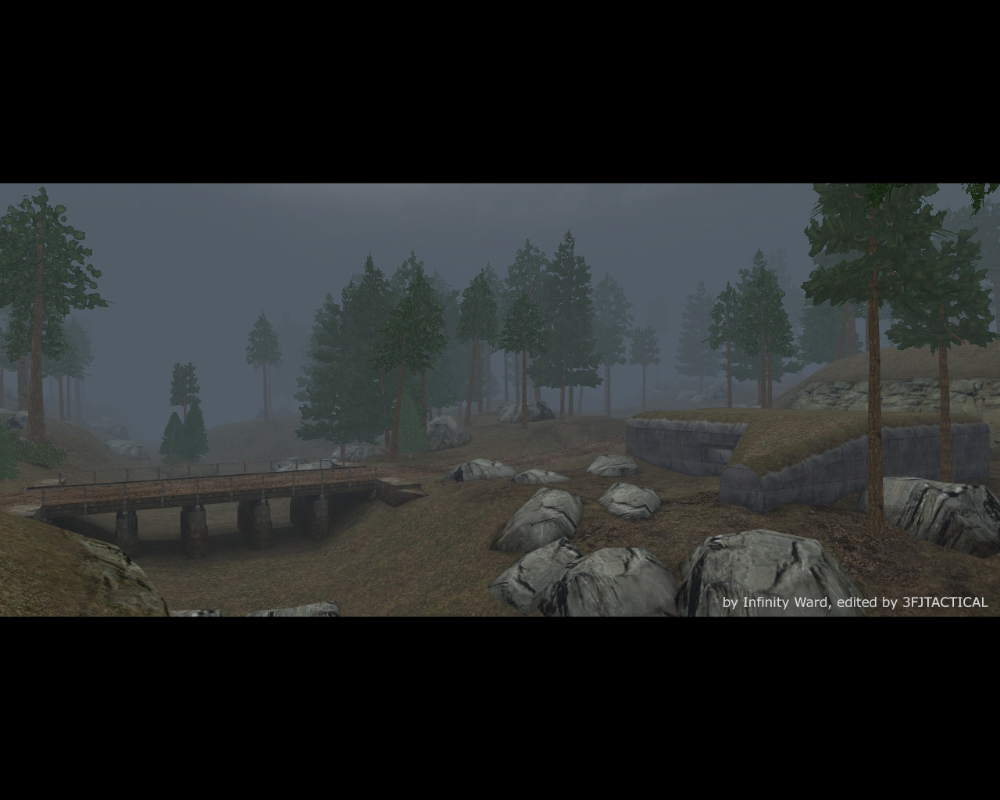 

> &nbsp; **Entry:**  32     

> &nbsp; **Entry:**  33     
> &nbsp; **Changes on `mp_merville_battery` made by [HOLY] Moses [07-2004]**
- known as `mp_merville_battery`
- HUD map layout edited and overhauled to match the game scheme	`\levelshots\layouts`    
- Updated levelshot `\levelshots`  
 
 

> &nbsp; **Entry:**  34    
> &nbsp; **Changes on `mp_junobeach` made by [126th] Televinken [12-2004]**
- known as `mp_junobeach`
- HUD map layout edited and overhauled to match the game scheme	`\levelshots\layouts`    
- Updated levelshot `\levelshots`  
 
 

> &nbsp; **Entry:**  8 & 9    
> &nbsp; **Changes on `mp_pegasusnight` & `mp_pegasusday` made by IW**
- known as singleplayers levers, edited all spawns and minor models -- reissue_
- HUD map layout edited and overhauled to match the game scheme	`\levelshots\layouts`    
- Updated levelshot `\levelshots`  
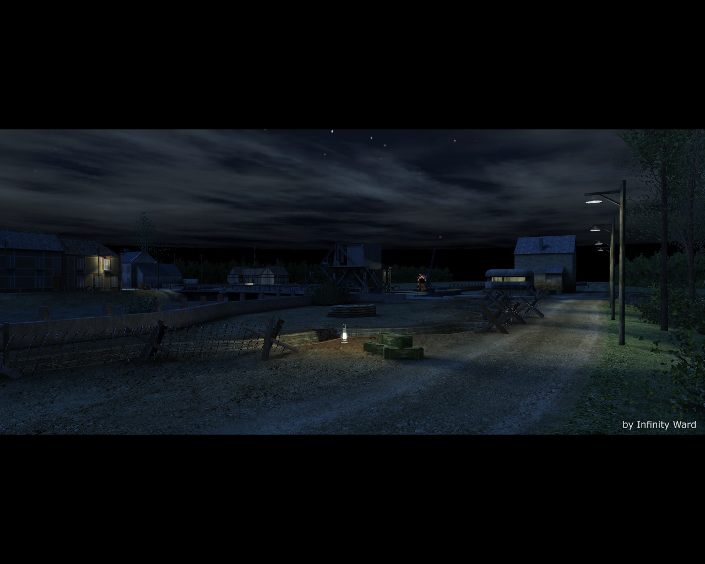 
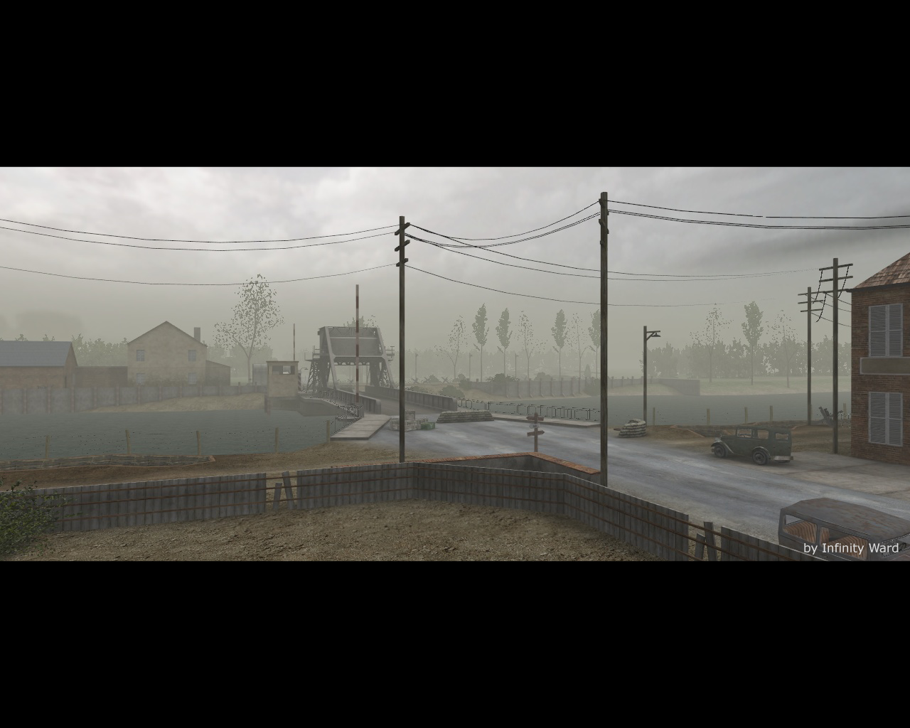 
 

> &nbsp; **Entry:**  35    
> &nbsp; **Changes on `mp_priory` made by Filbert [08-2006]**
- known as `mp_priory`
- HUD map layout edited and overhauled to match the game scheme	`\levelshots\layouts`    
- Updated levelshot `\levelshots`  
 
 

> &nbsp; **Entry:**  36     
> &nbsp; **Changes on `mp_redoktober` made by Drecks, Lex & Innocent Bystander [09-2004]**
- known as `mp_redoktober`
- HUD map layout edited and overhauled to match the game scheme	`\levelshots\layouts`    
- Updated levelshot `\levelshots`  
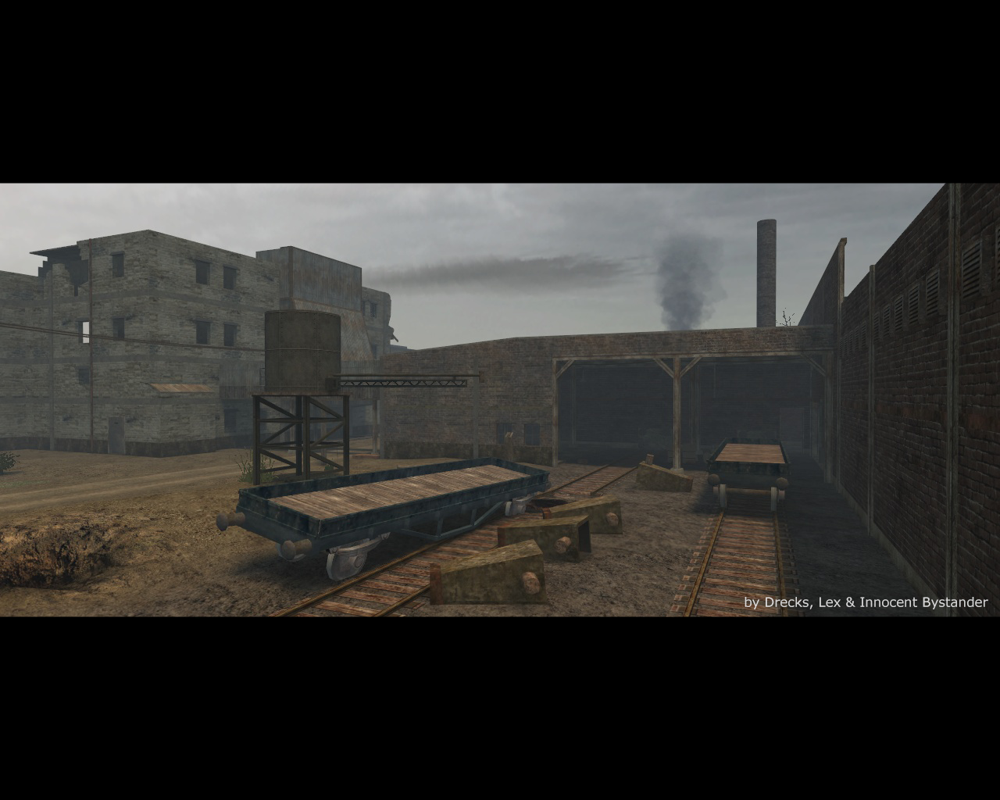 
 

> &nbsp; **Entry:**  37     
> &nbsp; **Changes on `mp_stanjel` made by Roger Abrahamsson [04-2006]**
- known as `mp_stanjel`
- HUD map layout edited and overhauled to match the game scheme	`\levelshots\layouts`    
- Updated levelshot `\levelshots`  
 
 

> &nbsp; **Entry:**  38    
> &nbsp; **Changes on `mp_stcomedumont` made by maverick & Lt.J.Snellius [02-2005]**
- known as `x` `x`
- HUD map layout edited and overhauled to match the game scheme	`\levelshots\layouts`    
- Updated levelshot `\levelshots`  
 
 

> &nbsp; **Entry:**  39     
> &nbsp; **Changes on `mp_steny` made by Spik3d [07-2007]**
- known as `x` `x`
- HUD map layout edited and overhauled to match the game scheme	`\levelshots\layouts`    
- Updated levelshot `\levelshots`  
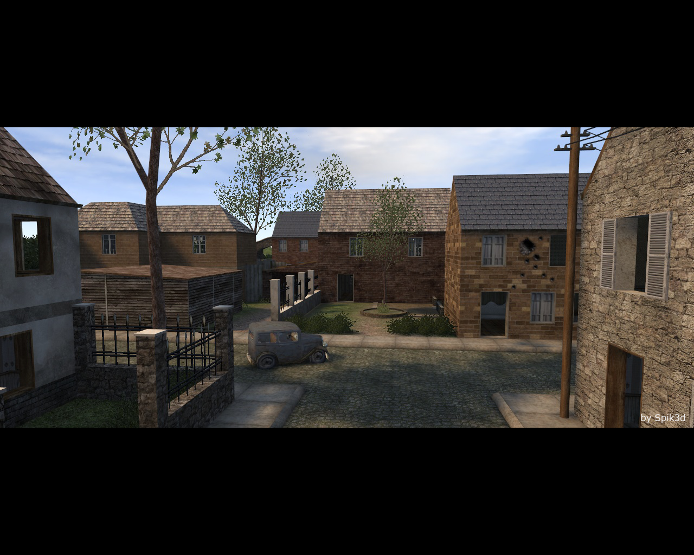 
 

> &nbsp; **Entry:**  40 & 81    
> &nbsp; **Changes on `mp_subharbor_day` & `mp_subharbor_night` made by VegaObscura [03-2004]**
- known as `x` `x`
- HUD map layout edited and overhauled to match the game scheme	`\levelshots\layouts`    
- Updated levelshot `\levelshots`  
 

> &nbsp; **Entry:**  41     
> &nbsp; **Changes on `mp_trenchville` made by S.C. [07-2005]**
- known as `x` `x`
- HUD map layout edited and overhauled to match the game scheme	`\levelshots\layouts`    
- Updated levelshot `\levelshots`  
 
 

> &nbsp; **Entry:**  42    
> &nbsp; **Changes on `mp_varaville` made by IW + Slyk & Innocent Bystander [04-2004]**
- based burnville and (mp_)dawnville
- known as `x` `x`
- HUD map layout edited and overhauled to match the game scheme	`\levelshots\layouts`    
- Updated levelshot `\levelshots`  
- TBA   
 

> &nbsp; **Entry:**  43    
> &nbsp; **Changes on `mp_westwall` made sm0k3r [12-2003]**
- known as `x` `x`
- HUD map layout edited and overhauled to match the game scheme	`\levelshots\layouts`    
- Updated levelshot `\levelshots`  
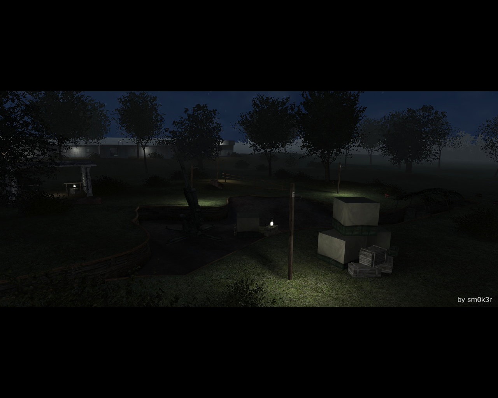 
 

> &nbsp; **Entry:**  44     
> &nbsp; **Changes on `mp_windmills` made by VegaObscura [05-2004]**
- known as `x` `x`
- HUD map layout edited and overhauled to match the game scheme	`\levelshots\layouts`    
- Updated levelshot `\levelshots`  
 

  
### ***Changes On Custom Winter Maps***   

> &nbsp; **Entry:**  45    
> &nbsp; **Changes on `mp_brecourt_winter` made by -OCG-=gLiTcH= [08-2004]**
- known as `mp_brecourt_winter`
- Modes: dm, tdm, sd, re, bel, hq      
 
 

> &nbsp; **Entry:**  46    
> &nbsp; **Changes on `mp_bonneville` made by [CF] WillyWonka [07-2004]**
- known as `mp_bonneville`   
 

> &nbsp; **Entry:**  47   
> &nbsp; **Changes on `mp_container` made by openf1re [06-2004]**
- known as `mp_container`
- *DM may be added*   
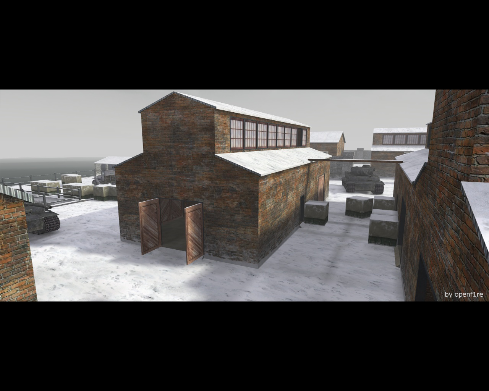 

> &nbsp; **Entry:**  xx    
> &nbsp; **Changes on `mp_dufresne_winter` made by [HG] Baby Seal Clubber [08-2004]**
- known as `mp_dufresne_winter`
- *Summer a. present*    
 

> &nbsp; **Entry:**  48    
> &nbsp; **Changes on `mp_eisberg` made by Fangio [12-2003]**
- known as `mp_eisberg`
- Small sized map    
 
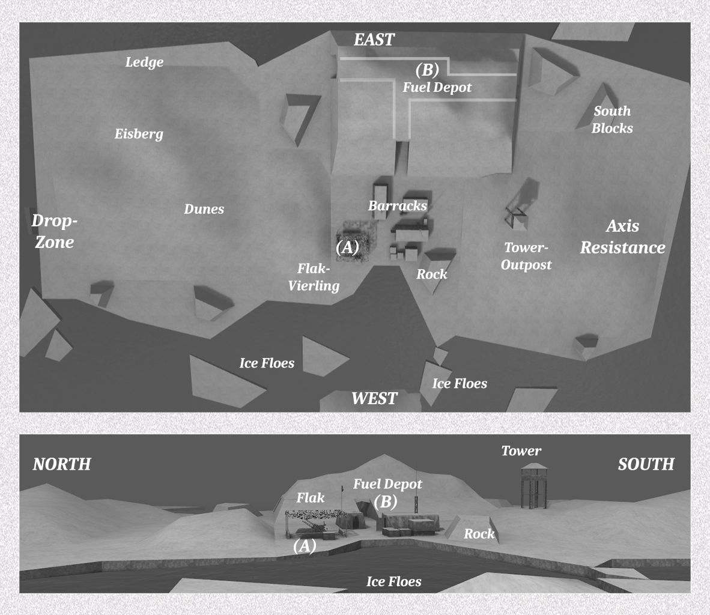

> &nbsp; **Entry:**  49, 77, 78   
> &nbsp; **Changes on `mp_frozen` made by SIFFER [02-2004]**
- Small sized map    

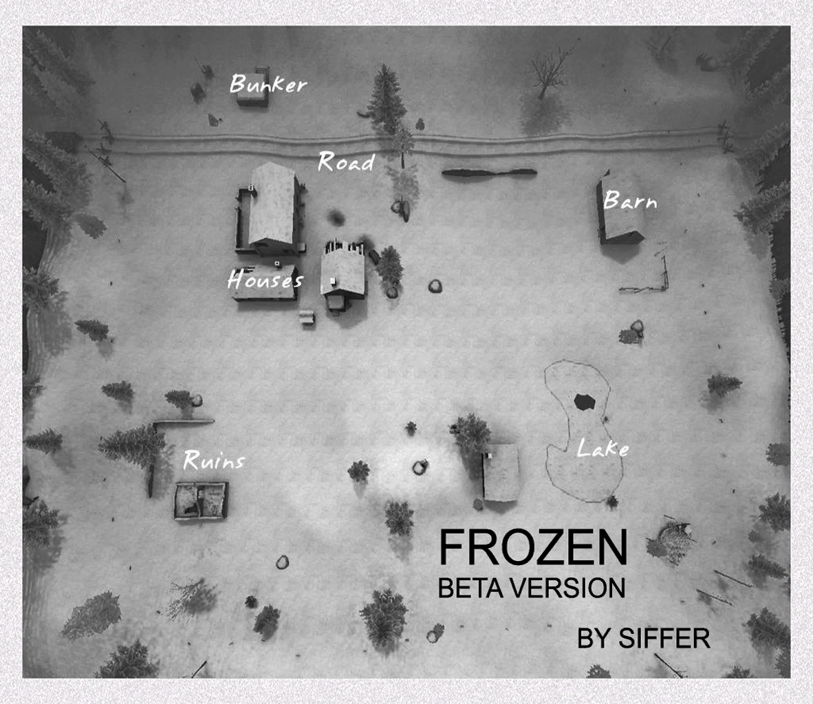

> &nbsp; **Entry:**  50   
> &nbsp; **Changes on `gg_harbor` made by IW + TheGoog [06-2021]**
- known as `gg_harbor` `z_gg_harbor.pk3`
- ~~HUD map layout edited and overhauled to match the game scheme	`\levelshots\layouts`~~    
- Updated levelshot `\levelshots`    
- source: `https://github.com/thegoog1337`    
- deactivated teleporter while `g_gametype` `sd` & `hq`     
 
 

> &nbsp; **Entry:**  51   
> &nbsp; **Changes on `mp_logging_mill` made by Dex [06-2007]**
- Small sized map    
 
 

> &nbsp; **Entry:**  52    
> &nbsp; **Changes on `mp_maaloy` made by [126th] Televinken [12-2004]**
- known as `mp_maaloy`    
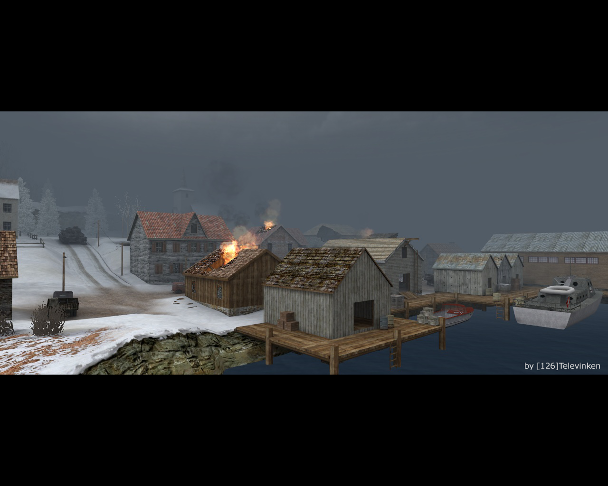 
 
 
> &nbsp; **Entry:**  53    
> &nbsp; **Changes on `mp_miniharbor` made by IW + TheGoog & JtGz [05-2025]**
- known as `mp_miniharbor`    
 

> &nbsp; **Entry:**  54   
> &nbsp; **Changes on `mp_offensive` made by Old-Crow & Caskou [02-2004]**
- known as `mp_offensive`   
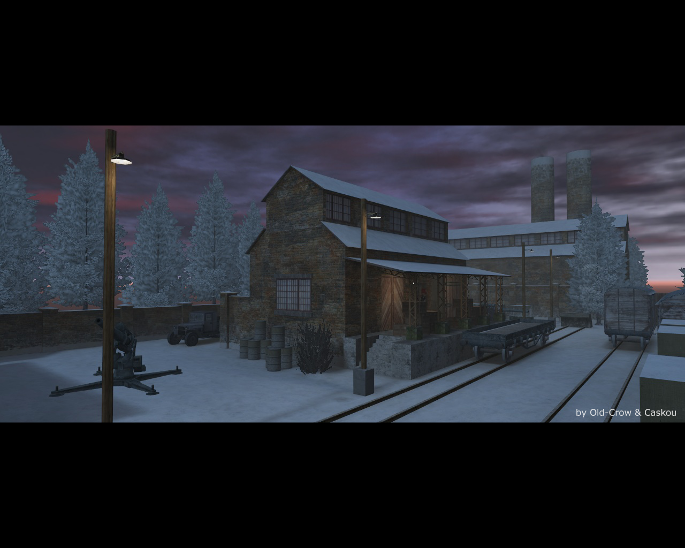 

> &nbsp; **Entry:**  55   
> &nbsp; **Changes on `mp_univermag` made by Drecks & Innocent Bystander [02-2004]**
- known as `mp_univermag`    
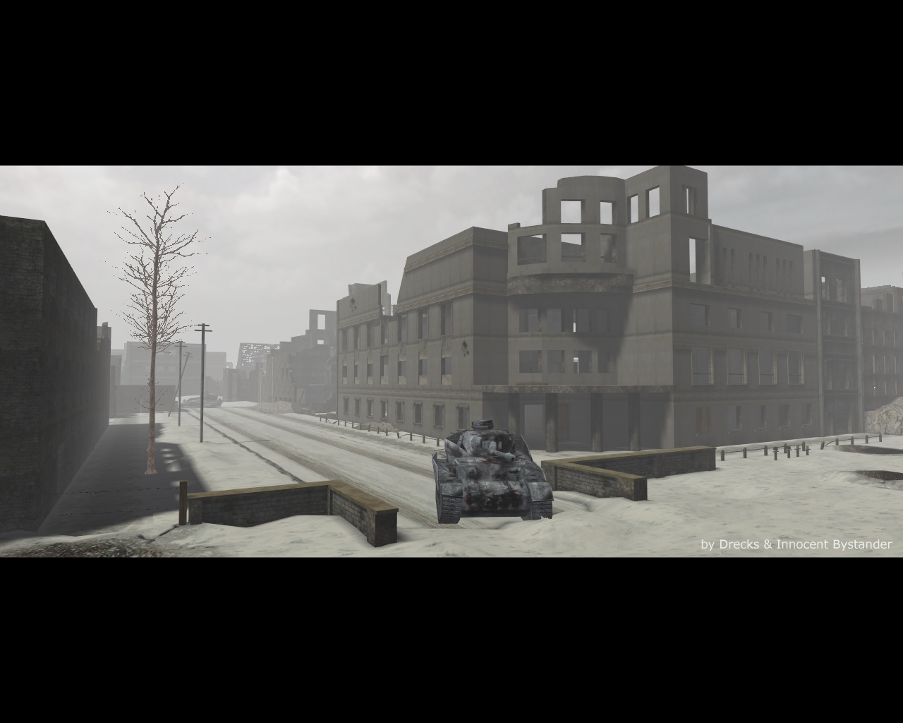 

> &nbsp; **Entry:**  56 & 82   
> &nbsp; **Changes on `mp_valley_day` & `mp_valley_night` made by VegaObscura [03-2004]**
- known as `mp_valley_day`    
 
 
 

> &nbsp; **Entry:**  57   
> &nbsp; **Changes on `mp_winterambush` made by Unknown [03-2006]**
- known as `mp_winterambush`   
 
 

  

### ***Changes On MOHAA-Like Custom Maps (Blurred Remembrance)***

> &nbsp; **Entry:**  58    
> &nbsp; **Changes on `mp_brest` made by VikingWiedel [09-2004]**
- known as `mp_brest`      
 

> &nbsp; **Entry:**  59   
> &nbsp; **Changes on `mp_bridge` made by [tFp] CFH666 [09-2004]**
- known as `mp_bridge`     
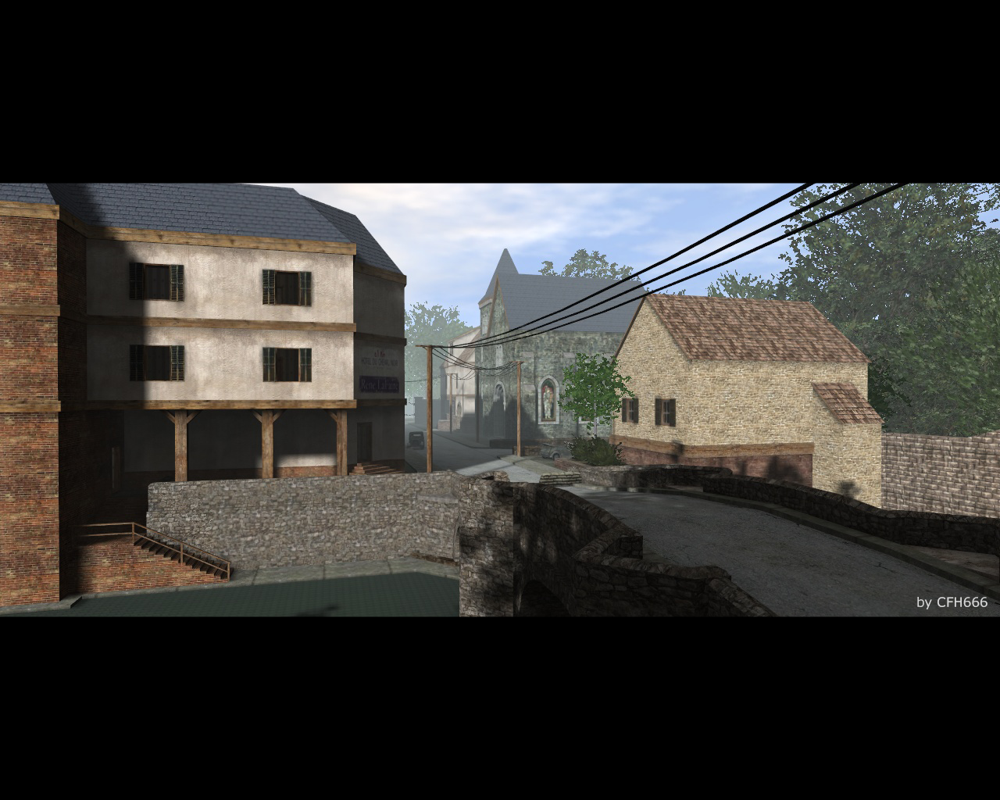 

> &nbsp; **Entry:**  60  
> &nbsp; **Changes on `mp_bridge_a` made by VikingWiedel [06-2004]**
- known as `moh_bridge_sdver` `moh_bridge_sdver.pk3` / `moh_bridge_beta` `Moh_Bridge.pk3`    
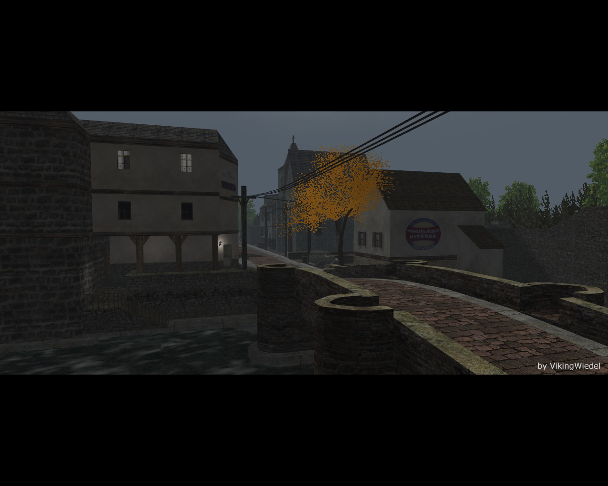 

> &nbsp; **Entry:**  61   
> &nbsp; **Changes on `mp_destroyed_village` made by -OCG-=gLiTcH= [05-2005]**
- known as `mp_destroyed_village`    
 

> &nbsp; **Entry:**  62   
> &nbsp; **Changes on `mp_hunt` made by [tFp] Daryl Strawberry [08-2004]**
- known as `mp_hunt`    
 

> &nbsp; **Entry:**  63    
> &nbsp; **Changes on `mp_remagen` made by nash [08-2004]**
- known as `mp_remagen`   
- *Breakable Windows*    
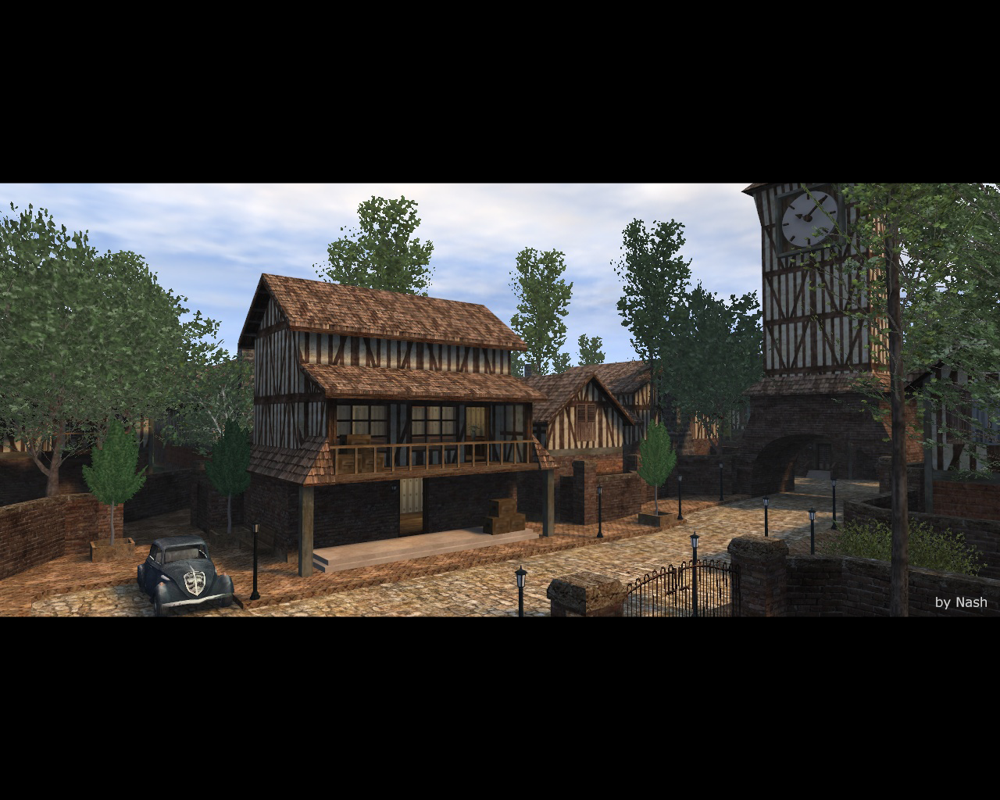 

> &nbsp; **Entry:**  64    
> &nbsp; **Changes on `mp_rocket_facility` made by -TFO- Kilroy [02-2004]**
- known as `mp_rocket_facility`
- *Openable doors*    
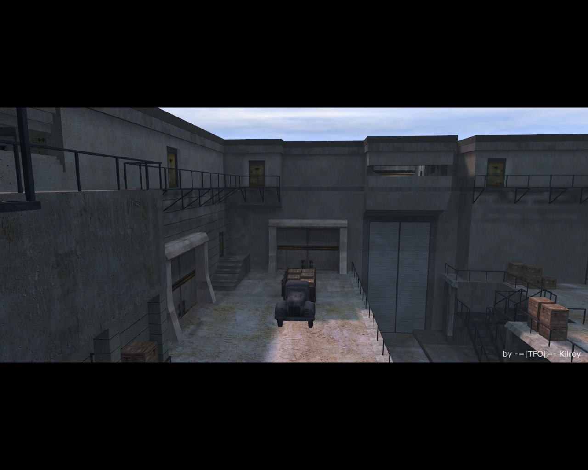 
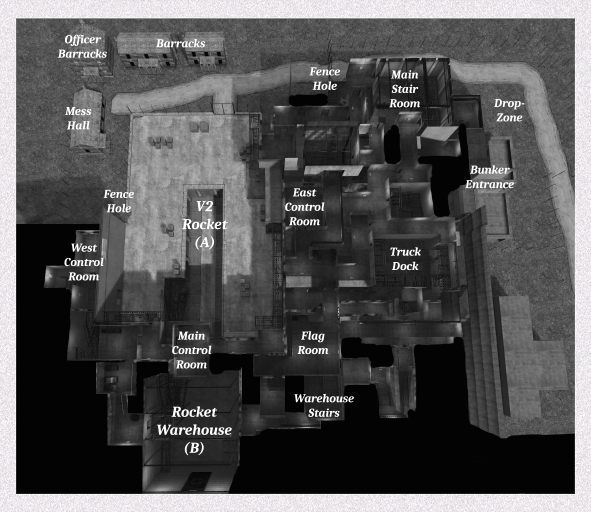

> &nbsp; **Entry:**  80    
> &nbsp; **Changes on `mp_nuenen` made [AYM] Lt Jules**
- known as `mp_nuenen`
- HUD map layout edited and overhauled to match the game scheme	`\levelshots\layouts`    
- Updated levelshot `\levelshots`  
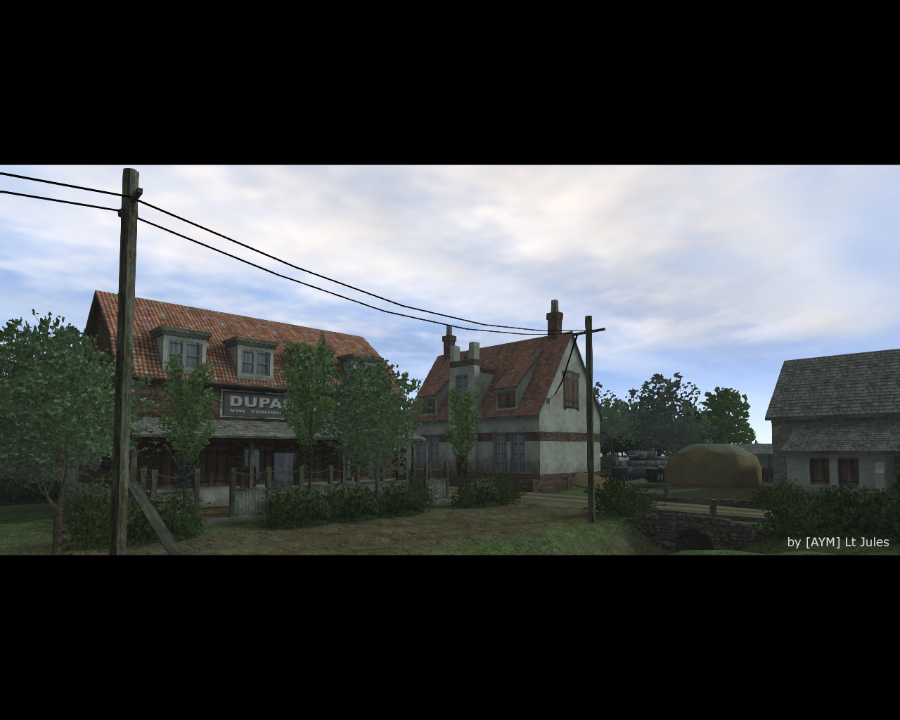 
    